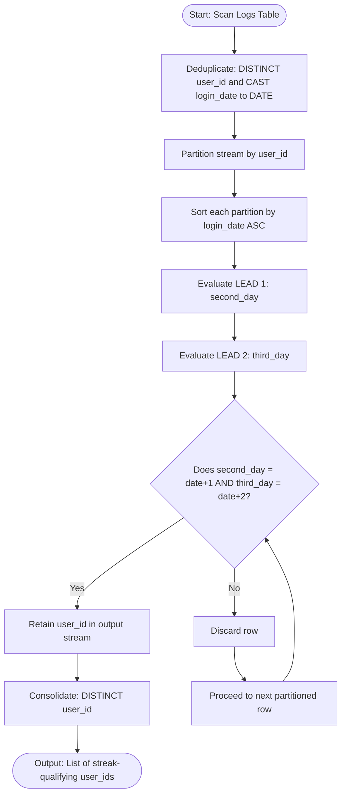
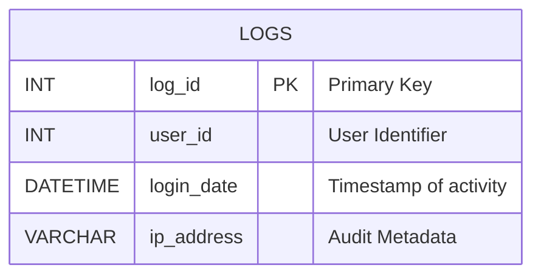

# Find users active for 3+ consecutive days.

### 1. Structured Problem Statement

#### Objective
Identify all unique users who have logged into the platform on at least three consecutive calendar days.

#### Business Scenario
Daily active streaks (such as 3-day, 7-day, or 30-day streaks) are critical indicators of product habituation, user engagement, and customer retention. Platforms like educational apps, fitness trackers, and SaaS environments actively monitor these patterns to trigger automated reward loops (e.g., streak milestones) or prioritize marketing intervention if a high-value user's daily streak is broken.

#### Constraints & Challenges
* **Intraday Multi-Logins**: Users often log in multiple times in a single day (e.g., morning, afternoon, and evening). If the table is not deduplicated before calculation, consecutive-day evaluations using row-based math or joins will generate incorrect streaks.
* **Join Multiplication Explosion**: The basic self-join solution (`Logs a JOIN Logs b JOIN Logs c`) exhibits $O(N^3)$ complexity, which degrades rapidly on large tables [1]. If a single active user logs in 100 times, the join engine evaluates $100^3 = 1,000,000$ rows for that user alone.
* **Non-Sequential Dates and Gaps**: Missing calendar days must break the streak. Simple sequence-number subtraction (such as subtracting row numbers) can fail if not executed with strict calendar-day interval arithmetic.

---

### 2. The SQL Solution

This production-grade solution uses a Common Table Expression (CTE) to deduplicate daily logins, and then applies the `LEAD` window function to check consecutive date boundaries efficiently [1].

```sql
WITH DeduplicatedLogins AS (
    -- Step 1: Consolidate multiple logins on the same day by the same user
    SELECT DISTINCT 
        user_id, 
        CAST(login_date AS DATE) AS login_date
    FROM Logs
),
ConsecutiveWindows AS (
    -- Step 2: Fetch the next two chronological login dates for each user partition
    SELECT 
        user_id,
        login_date,
        LEAD(login_date, 1) OVER (PARTITION BY user_id ORDER BY login_date) AS second_day,
        LEAD(login_date, 2) OVER (PARTITION BY user_id ORDER BY login_date) AS third_day
    FROM DeduplicatedLogins
)
-- Step 3: Filter for exact consecutive day gaps and isolate unique users
SELECT DISTINCT user_id
FROM ConsecutiveWindows
WHERE second_day = login_date + INTERVAL '1' DAY
  AND third_day = login_date + INTERVAL '2' DAY;
```

> [!IMPORTANT]  
> **Avoiding the Multi-Join Performance Bottleneck**:
> Self-join patterns scale poorly under heavy volume [1]. The window function (`LEAD`/`LAG`) approach executes in linear-logarithmic time ($O(N \log N)$) because it relies on standard partition sorting rather than cartesian product matching, keeping CPU usage low on large datasets.

> [!NOTE]  
> **Platform-Specific Date Offsets**:
> * **PostgreSQL**: `second_day = login_date + INTERVAL '1 day'` (or `login_date + 1`)
> * **SQL Server (T-SQL)**: `second_day = DATEADD(day, 1, login_date)`
> * **MySQL**: `second_day = login_date + INTERVAL 1 DAY`

---

### 3. Procedural Decomposition

The query engine evaluates and processes this streak calculation in five distinct steps:

#### Phase 1: Intraday Deduplication
The database engine executes the `DeduplicatedLogins` CTE. It extracts the `user_id` and strips the timestamp from `login_date` to get the calendar date. Applying the `DISTINCT` operator ensures that if a user logs in multiple times on a single day, they are represented by only a single record in the pipeline.

#### Phase 2: Window Partitioning and Sorting
The engine groups the deduplicated stream by `user_id` (partitioning) and sorts the dates within each user group in ascending order.

#### Phase 3: Forward Index Lookups
While executing the partitioned stream, the engine evaluates the two `LEAD` window functions:
* `second_day`: Peeks exactly 1 step forward in the sorted list.
* `third_day`: Peeks exactly 2 steps forward in the sorted list.

#### Phase 4: Consecutive Gap Validation
The engine evaluates the outer query’s `WHERE` clause. For each row, it checks if `second_day` is exactly 1 day after `login_date`, and if `third_day` is exactly 2 days after `login_date`. If both evaluations are true, the row passes the filter.

#### Phase 5: Cardinality Collapsing
A user with a 5-day consecutive streak will pass this check on Day 1, Day 2, and Day 3. The outer query applies the `DISTINCT` operator on `user_id` to deduplicate these occurrences, returning a list of unique users who achieved the streak.

---

### 4. Order of Execution & Activity Flow (Mermaid Diagram)



---

### 5. Database Schema (Mermaid Diagram)

The following schema diagram represents the database logs table and details the multi-column index structure required to optimize partitioning operations.



> [!TIP]  
> Because this calculation partitions by `user_id` and sorts by `login_date` to compute window offsets, construct a **composite index** on `(user_id, login_date)`. This allows the query engine to retrieve pre-sorted partitions directly from disk, completely skipping the resource-intensive internal sorting phase at runtime:
> ```sql
> CREATE INDEX idx_logs_streak ON Logs (user_id, login_date);
> ```

---

### 6. Practice Setup Script (DDL & DML)

This script sets up a test table, builds the required composite index, and inserts test profiles tracking consecutive daily logins, gaps, and intraday duplicate entries.

```sql
-- Clean up target table if it already exists
DROP TABLE IF EXISTS Logs;

-- Create target user log table
CREATE TABLE Logs (
    log_id INT NOT NULL,
    user_id INT NOT NULL,
    login_date DATETIME NOT NULL,
    ip_address VARCHAR(45),
    CONSTRAINT pk_logs PRIMARY KEY (log_id)
);

-- Index designed to optimize partitioning and chronological sorting
CREATE INDEX idx_logs_streak ON Logs (user_id, login_date);

-- Populate table with standard test profiles:
-- (Assuming the current year is 2026)
-- User 1001: Logged in June 1, 2, and 3 (3-day streak) -> Expected: MATCH
-- User 1002: Logged in June 1, 2 (twice), and 4 (broken streak) -> Expected: NO MATCH
-- User 1003: Logged in June 1, 2, 3, and 4 (4-day streak) -> Expected: MATCH
-- User 1004: Only logged in once on June 1 -> Expected: NO MATCH
INSERT INTO Logs (log_id, user_id, login_date, ip_address) VALUES
(1, 1001, '2026-06-01 08:00:00', '192.168.1.1'),
(2, 1001, '2026-06-02 09:30:00', '192.168.1.1'),
(3, 1001, '2026-06-03 14:15:00', '192.168.1.1'), -- Day 3
(4, 1002, '2026-06-01 10:00:00', '192.168.1.2'),
(5, 1002, '2026-06-02 11:00:00', '192.168.1.2'),
(6, 1002, '2026-06-02 21:00:00', '192.168.1.2'), -- Intraday duplicate login
(7, 1002, '2026-06-04 15:30:00', '192.168.1.2'), -- Gap on June 3 breaks streak
(8, 1003, '2026-06-01 07:00:00', '192.168.1.3'),
(9, 1003, '2026-06-02 08:00:00', '192.168.1.3'),
(10, 1003, '2026-06-03 09:00:00', '192.168.1.3'), -- Day 3
(11, 1003, '2026-06-04 10:00:00', '192.168.1.3'), -- Day 4
(12, 1004, '2026-06-01 12:00:00', '192.168.1.4');
```
