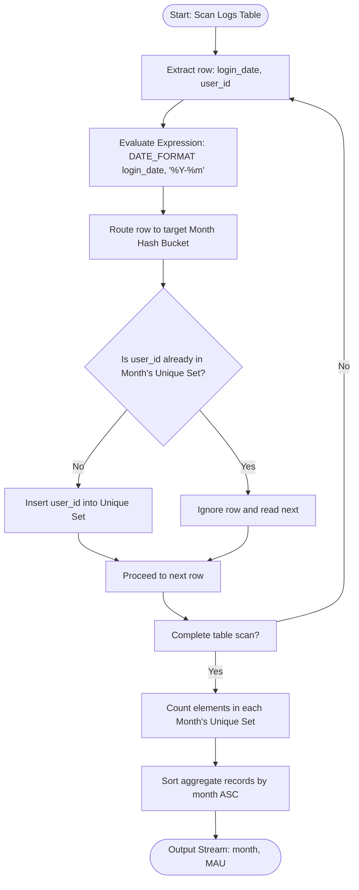
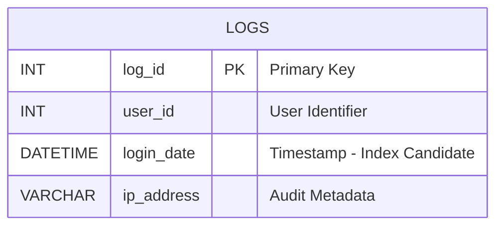

# Calculate monthly active users (MAU).

### 1. Structured Problem Statement

#### Objective
Calculate Monthly Active Users (MAU) from a system interaction log by counting the number of unique users who recorded at least one activity during each calendar month.

#### Business Scenario
Monthly Active Users (MAU) is a key performance indicator (KPI) used by product teams, executives, and investors to gauge product health, active audience growth, customer retention, and platform scale. It converts raw, high-frequency activity streams into stable, aggregate metrics that reveal overall engagement trends.

#### Constraints & Challenges
* **Computational Complexity of Unique Counting**: Unlike basic aggregations like `COUNT(*)`, calculating `COUNT(DISTINCT user_id)` requires the query engine to track the complete set of unique IDs encountered within each monthly bucket. For large transaction volumes, this forces intensive in-memory sorting or hash-set caching, which can easily spill over to disk and slow down performance.
* **Non-Standard SQL Grouping Rules**: Grouping by select-list column aliases (such as `month`) is supported in MySQL, but violates strict ANSI standards. Stricter database systems (like Oracle or PostgreSQL) will throw syntax errors, requiring you to group explicitly by the exact date-formatting expression.
* **Volume Bottlenecks**: In databases logging millions of rows daily, calculating exact MAU over long periods can strain system memory.

---

### 2. The SQL Solution

This query aggregates active sessions by calendar month and calculates the unique user cardinality, using standard ANSI-compliant expressions in the grouping clause.

```sql
SELECT 
    -- Transform the full login date into a year-month format
    DATE_FORMAT(login_date, '%Y-%m') AS month, 
    -- De-duplicate user IDs to calculate unique monthly profiles
    COUNT(DISTINCT user_id) AS MAU
FROM Logs
-- Group strictly by the formatted expression to maintain ANSI compliance
GROUP BY DATE_FORMAT(login_date, '%Y-%m')
ORDER BY month ASC;
```

> [!IMPORTANT]  
> **ANSI SQL Grouping Portability**:
> Relational databases process the `GROUP BY` clause *before* parsing the column aliases defined in the `SELECT` list. For cross-platform compatibility (e.g., migrating from MySQL to PostgreSQL or SQL Server), you must group by the raw functional expression (`GROUP BY DATE_FORMAT(...)`) rather than using the select alias.

> [!NOTE]  
> **PostgreSQL Alternative**:
> In PostgreSQL, use the `TO_CHAR()` or `DATE_TRUNC()` date formatting functions:
> ```sql
> SELECT 
>     TO_CHAR(login_date, 'YYYY-MM') AS month,
>     COUNT(DISTINCT user_id) AS MAU
> FROM Logs
> GROUP BY TO_CHAR(login_date, 'YYYY-MM')
> ORDER BY month ASC;
> ```

---

### 3. Procedural Decomposition

The query processor executes this Monthly Active Users calculation using the following phases:

#### Phase 1: Storage Scanning
The storage engine scans the `Logs` table, loading the relevant payload columns (`login_date` and `user_id`) into memory.

#### Phase 2: Year-Month Key Extraction
The date-time library evaluates the `DATE_FORMAT(login_date, '%Y-%m')` expression on each row, transforming granular timestamps (such as `2026-06-02 11:49:00`) into year-month partition strings (e.g., `2026-06`).

#### Phase 3: Hash Map Aggregation
The engine allocates memory for an aggregation hash map where each unique year-month partition string represents a bucket:
* When a row with a new month string is evaluated, a new bucket is initialized.
* Along with each bucket, the engine instantiates an in-memory hash set (or bitmap) to track distinct `user_id` values.

#### Phase 4: Unique Set Insertion
For each incoming row routed to its respective month bucket:
1. The engine checks if the row's `user_id` already exists in that month's hash set.
2. If it does, the record is skipped.
3. If it does not, the ID is added to the hash set.

#### Phase 5: Cardinality Counting and Projection
Once all rows have been processed, the query engine counts the number of elements in each month's hash set. It applies the alias `MAU`, sorts the output by the `month` key ascending, and streams the rows to the client.

---

### 4. Order of Execution & Activity Flow (Mermaid Diagram)



---

### 5. Database Schema (Mermaid Diagram)

The following schema diagram represents the `Logs` layout, emphasizing the composite indexing pattern required to optimize MAU calculations on large-scale tables.



> [!TIP]  
> To optimize high-volume MAU calculations, construct a **composite covering index** on `(login_date, user_id)`. This index design allows the database engine to perform an Index-Only Scan. The engine can extract dates and de-duplicate IDs entirely within the index leaf nodes, avoiding the need to access the table data on disk:
> ```sql
> CREATE INDEX idx_logs_mau ON Logs (login_date, user_id);
> ```

---

### 6. Practice Setup Script (DDL & DML)

This script builds the test database, structures the covering index, and populates it with various logins—including multiple logins by the same users within a month—to verify that de-duplication works as expected.

```sql
-- Clean up target table if it already exists
DROP TABLE IF EXISTS Logs;

-- Create target user log table
CREATE TABLE Logs (
    log_id INT NOT NULL,
    user_id INT NOT NULL,
    login_date DATETIME NOT NULL,
    ip_address VARCHAR(45),
    CONSTRAINT pk_logs PRIMARY KEY (log_id)
);

-- Build a composite index on the date and user ID to optimize distinct count aggregations
CREATE INDEX idx_logs_mau ON Logs (login_date, user_id);

-- Populate table with multi-login test profiles:
-- (Assuming the current year is 2026)
-- Target: 2026-05 and 2026-06 partitions
INSERT INTO Logs (log_id, user_id, login_date, ip_address) VALUES
(1, 1001, '2026-05-10 08:30:00', '192.168.1.1'),
(2, 1001, '2026-05-12 14:20:00', '192.168.1.1'), -- Duplicate login for User 1001 in May
(3, 1002, '2026-05-15 11:05:00', '192.168.1.2'), -- Unique login for User 1002 in May
(4, 1001, '2026-06-01 09:15:00', '192.168.1.1'), -- Unique login for User 1001 in June
(5, 1003, '2026-06-02 10:00:00', '192.168.1.3'), -- Unique login for User 1003 in June
(6, 1003, '2026-06-02 11:30:00', '192.168.1.3'); -- Duplicate login for User 1003 in June
```
