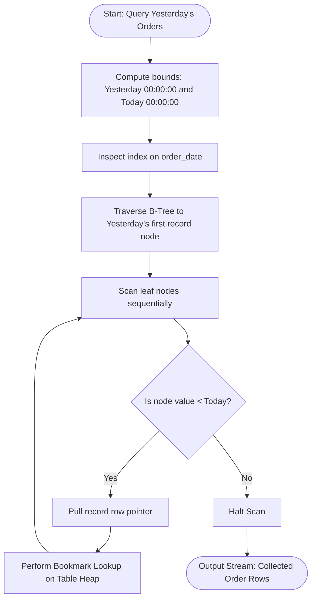
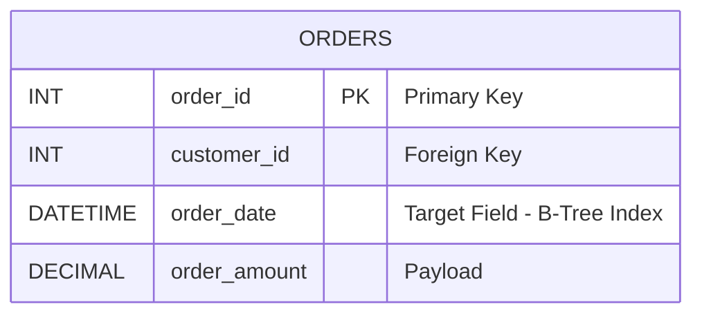

# Find orders placed yesterday.
### 1. Structured Problem Statement

#### Objective
Retrieve all orders placed on the previous calendar day (yesterday) relative to the current system date, ensuring the query is optimized to utilize indexes and handles both date and date-time data types correctly.

#### Business Scenario
Daily audit reports, warehouse dispatch logs, payment clearing pipelines, and executive sales charts depend heavily on retrieving the previous day's transactional records. Automated nightly cron jobs query databases to generate summaries of the completed business day, routing orders to delivery couriers or auditing logs for payment anomalies.

#### Constraints & Challenges
* **The Sargability Trap**: Wrapping the `order_date` database column in the `DATE()` function—e.g., `WHERE DATE(order_date) = ...`—prevents the query optimizer from leveraging standard B-Tree indexes. The engine is forced to evaluate the function for every single record in the database, resulting in a performance-killing **Full Table Scan**.
* **Temporal Truncation**: If the `order_date` column is a `DATETIME` or `TIMESTAMP` type, comparing it to a single date literal using equality (e.g., `= '2026-06-01'`) fails to capture any records with non-zero time components (e.g., an order at `2026-06-01 14:30:00` would be skipped because it does not equal `2026-06-01 00:00:00`).
* **Time Zone Offsets**: Relational dynamic current-date functions (`CURDATE()`, `NOW()`) evaluate relative to the database host server's local system time, which can lead to data overlaps or gaps if user time zones differ from server settings.

### 2. The SQL Solution

This optimized, sargable query avoids wrapping the column in functions and utilizes a range-based check, ensuring compatibility with `DATE`, `DATETIME`, and `TIMESTAMP` columns [3].

```sql
SELECT 
    order_id,
    customer_id,
    order_date,
    order_amount
FROM Orders
-- A range check allows the optimizer to use an index on the date column
WHERE order_date >= DATE_SUB(CURDATE(), INTERVAL 1 DAY)
  AND order_date < CURDATE();
```

> [!IMPORTANT]  
> **Sargable vs. Non-Sargable Performance**:
> A query is considered "Sargable" (Search Argument Able) when the database engine can jump directly to the target records using an index. 
> * **Non-Sargable (Slow)**: `WHERE DATE(order_date) = DATE_SUB(CURDATE(), INTERVAL 1 DAY)` -> Forces a Full Table Scan because `DATE()` must be evaluated for every row.
> * **Sargable (Fast)**: `WHERE order_date >= DATE_SUB(CURDATE(), INTERVAL 1 DAY) AND order_date < CURDATE()` -> Performs an Index Range Scan.

> [!NOTE]  
> **PostgreSQL Alternative**:
> In PostgreSQL, construct the range comparison using the `CURRENT_DATE` and `INTERVAL` keywords:
> ```sql
> SELECT *
> FROM Orders
> WHERE order_date >= CURRENT_DATE - INTERVAL '1 day'
>   AND order_date < CURRENT_DATE;
> ```

### 3. Procedural Decomposition

The database query engine evaluates and executes this range-based filter using the following phases:

#### Phase 1: Range Boundary Calculation
Before reading any data from disk, the query compiler evaluates the static boundaries in the `WHERE` clause:
* Lower Bound: `CURDATE() - 1 Day` (evaluates to `2026-06-01 00:00:00` relative to a current date of `2026-06-02`).
* Upper Bound: `CURDATE()` (evaluates to `2026-06-02 00:00:00`).

#### Phase 2: Index Root Extraction
The query planner scans the metadata of the `Orders` table, identifies the index on `order_date`, and determines that an **Index Range Scan** is the optimal execution path.

#### Phase 3: B-Tree Traversal & Node Scanning
The execution engine traverses the B-Tree index down to the leaf node corresponding to the lower-bound date (`2026-06-01 00:00:00`). It reads sequentially forward through the sorted index leaf nodes, gathering matched pointers, until it hits the upper-bound threshold (`2026-06-02 00:00:00`), at which point it halts immediately.

#### Phase 4: Bookmark Lookup and Projection
For the index keys that fell within the yesterday range, the engine reads their physical row pointers and performs a quick bookmark lookup on the data heap to extract missing attributes (such as `order_amount`) before outputting the records.

### 4. Order of Execution & Activity Flow (Mermaid Diagram)



### 5. Database Schema (Mermaid Diagram)

The following diagram defines the physical layout of the `Orders` table, calling out the critical search index on the date-time parameter.



> [!TIP]  
> If you regularly run daily and yesterday-oriented reporting queries, you can eliminate the table-lookup phase entirely by constructing a **covering index**. By adding the query payload columns directly to the index nodes, the database engine can fulfill the entire query from the index pages alone, avoiding disk heap reads:
> ```sql
> CREATE INDEX idx_orders_reporting_cover ON Orders (order_date, order_id, customer_id, order_amount);
> ```

### 6. Practice Setup Script (DDL & DML)

This script sets up the target table, builds the required reporting index, and inserts mock records tracking transaction logs across multiple days—including various time offsets—to demonstrate range-filtering accuracy.

```sql
-- Clean up target table if it already exists
DROP TABLE IF EXISTS Orders;

-- Create target orders table with primary keys and constraints
CREATE TABLE Orders (
    order_id INT NOT NULL,
    customer_id INT NOT NULL,
    order_date DATETIME NOT NULL,
    order_amount DECIMAL(10, 2) NOT NULL CHECK (order_amount > 0),
    CONSTRAINT pk_orders PRIMARY KEY (order_id)
);

-- Build a B-Tree search index on the order date column to facilitate range queries
CREATE INDEX idx_orders_date ON Orders (order_date);

-- Populate table with sample data tracking across multiple days:
-- (Assuming the current system date is June 2, 2026)
-- Target range for yesterday: >= '2026-06-01 00:00:00' AND < '2026-06-02 00:00:00'
INSERT INTO Orders (order_id, customer_id, order_date, order_amount) VALUES
(201, 101, '2026-05-31 23:59:00', 450.00), -- Past Range (Too old)
(202, 102, '2026-06-01 00:00:00', 125.00), -- Match (Yesterday Start)
(203, 103, '2026-06-01 12:30:00', 99.99),  -- Match (Yesterday Midday)
(204, 104, '2026-06-01 23:59:59', 1050.00), -- Match (Yesterday End boundary)
(205, 101, '2026-06-02 00:00:00', 75.00),  -- Future Range (Today - excluded)
(206, 105, '2026-06-02 08:15:00', 320.00); -- Future Range (Today - excluded)
```
