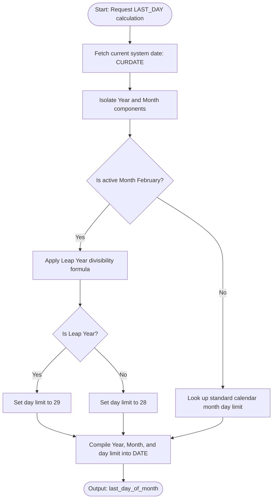
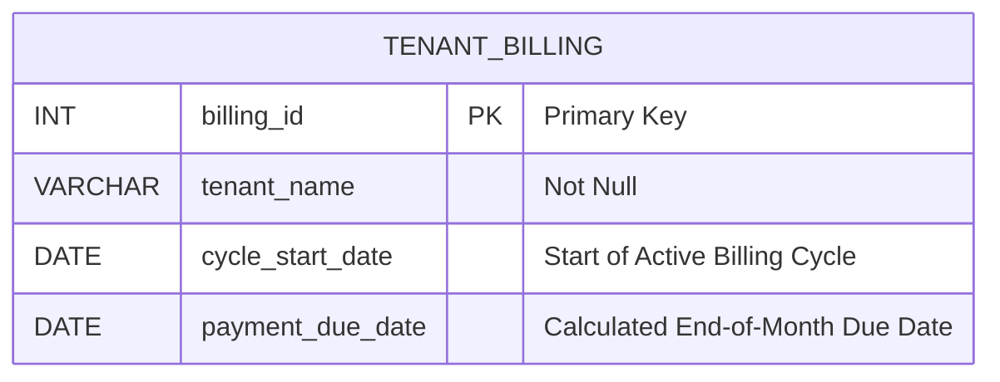

# Get the last day of the current month.

### 1. Structured Problem Statement

#### Objective
Determine the exact calendar date representing the final day of the current month. The calculation must dynamically adjust for varying month lengths (28, 30, or 31 days) and leap years (calculating February 28 versus February 29 correctly).

#### Business Scenario
Identifying the end of the calendar month is critical in SaaS subscription billing engines, banking ledger closures, payroll distributions, and automated financial auditing. For example, batch billing systems must calculate the final day of the month to execute monthly subscription charges, calculate accrued interest, or schedule recurring reports on dates that do not exist in every month (such as the 29th, 30th, or 31st).

#### Constraints & Challenges
* **Irregular Month Offsets**: Months vary in length, meaning hardcoded date arithmetic (such as adding 30 days) is structurally invalid.
* **Leap Year Dynamics**: Calculating the end of February requires checking if the year is divisible by 4, not divisible by 100, unless also divisible by 400.
* **Lack of SQL Standardization**: Different database engines resolve end-of-month dates using completely distinct function profiles, which can complicate schema and query migrations if left unmanaged.

### 2. The SQL Solution

This query extracts the current system date and computes the exact calendar end date for the active month using standard MySQL/MariaDB syntax.

```sql
SELECT 
    CURDATE() AS current_system_date,
    LAST_DAY(CURDATE()) AS last_day_of_month;
```

> [!NOTE]  
> **PostgreSQL Implementation**:
> PostgreSQL does not contain a native `LAST_DAY()` function. Instead, calculate this value by navigating to the first day of the current month, shifting forward by exactly one month, and subtracting a single calendar day:
> ```sql
> SELECT 
>     CURRENT_DATE AS current_system_date,
>     (DATE_TRUNC('month', CURRENT_DATE) + INTERVAL '1 month' - INTERVAL '1 day')::DATE AS last_day_of_month;
> ```

> [!IMPORTANT]  
> **SQL Server (T-SQL) Implementation**:
> Since SQL Server 2012, T-SQL supports the native `EOMONTH()` function. This function also supports an optional second parameter to offset the month window:
> ```sql
> SELECT 
>     GETDATE() AS current_system_date,
>     EOMONTH(GETDATE()) AS last_day_of_month,
>     -- Calculate the last day of the subsequent month (offset of 1)
>     EOMONTH(GETDATE(), 1) AS last_day_of_next_month;
> ```

### 3. Procedural Decomposition

The query processor executes this calculation in five chronological phases:

#### Phase 1: Retrieve System Time
The execution engine retrieves the current date from the host machine's hardware clock using `CURDATE()`.

#### Phase 2: Chronological Disassembly
The internal date-time processor extracts the raw Year and Month components from the system date value.

#### Phase 3: Leap Year Verification
If the extracted Month is February (`02`), the engine evaluates whether the Year is a leap year using the standard astronomical leap-year divisibility formula:
$$\text{LeapYear} = (\text{Year} \pmod 4 = 0 \land \text{Year} \pmod{100} \neq 0) \lor (\text{Year} \pmod{400} = 0)$$
If this evaluates to true, February's day limit is resolved as `29`; otherwise, it is resolved as `28`.

#### Phase 4: Month Length Lookup
If the Month is not February, the engine checks a standard static lookup mapping of month lengths (e.g., April, June, September, and November map to `30` days, while all remaining months map to `31` days).

#### Phase 5: Recompilation and Projection
The engine compiles the isolated Year, isolated Month, and resolved maximum day count back into a valid, standard `DATE` format, returning the result to the output stream.

### 4. Order of Execution & Activity Flow (Mermaid Diagram)



### 5. Database Schema (Mermaid Diagram)

While evaluating system constants does not require reading from disk, the following Entity Relationship diagram illustrates how end-of-month calculations function in a typical subscriber billing database.



> [!TIP]  
> In billing transaction tables where payment deadlines are always pinned to the final day of the starting billing month, you can automate this calculation at the schema level using a **computed column**. This keeps the application from having to calculate the deadline date on every write operation:
> ```sql
> -- MySQL Example
> CREATE TABLE Tenant_Billing (
>     billing_id INT AUTO_INCREMENT PRIMARY KEY,
>     tenant_name VARCHAR(100) NOT NULL,
>     cycle_start_date DATE NOT NULL,
>     payment_due_date DATE GENERATED ALWAYS AS (LAST_DAY(cycle_start_date)) STORED
> );
> ```

### 6. Practice Setup Script (DDL & DML)

This setup script builds a sample table matching the schema above, writes test profiles containing different cycle dates (including February during leap and non-leap cycles), and runs a query evaluating due dates.

```sql
-- Clean up target table if it already exists
DROP TABLE IF EXISTS Tenant_Billing;

-- Create target subscriber billing table
CREATE TABLE Tenant_Billing (
    billing_id INT NOT NULL,
    tenant_name VARCHAR(100) NOT NULL,
    cycle_start_date DATE NOT NULL,
    CONSTRAINT pk_tenant_billing PRIMARY KEY (billing_id)
);

-- Index the billing start date to optimize cycle lookups
CREATE INDEX idx_billing_cycle_start ON Tenant_Billing (cycle_start_date);

-- Populate table with test billing profiles across varying months:
-- Profile 1: Standard 31-day month (January)
-- Profile 2: Standard 30-day month (April)
-- Profile 3: Leap Year February (2024)
-- Profile 4: Non-Leap Year February (2025)
INSERT INTO Tenant_Billing (billing_id, tenant_name, cycle_start_date) VALUES
(101, 'Alpha Corp', '2026-01-15'),
(102, 'Beta LLC', '2026-04-05'),
(103, 'Gamma Systems', '2024-02-10'), -- Leap Year Cycle
(104, 'Delta Industries', '2025-02-10'); -- Non-Leap Year Cycle

-- Query the table to verify the calculated end-of-month payment due dates
SELECT 
    billing_id,
    tenant_name,
    cycle_start_date,
    LAST_DAY(cycle_start_date) AS payment_due_date
FROM Tenant_Billing
ORDER BY billing_id ASC;
```
