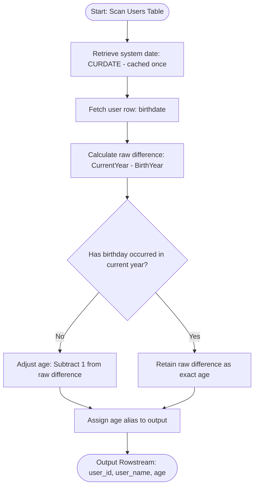
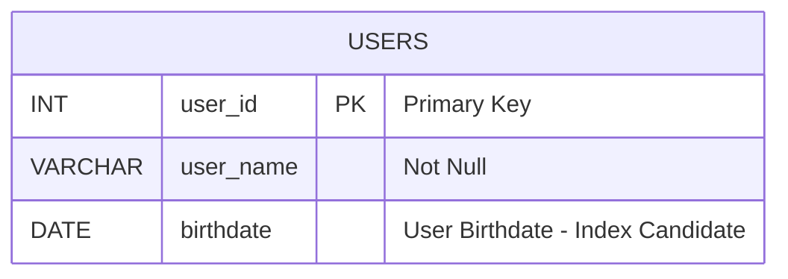

# Calculate age from birthdate

### 1. Structured Problem Statement

#### Objective
Calculate the exact age in years of individuals based on their birthdate relative to the current system date, adjusting dynamically for whether their birthday has occurred in the current calendar year.

#### Business Scenario
Age calculation is a foundational requirement in customer relationship management (CRM) systems, identity verification pipelines, compliance modules, and marketing analytics. Online platforms must dynamically enforce minimum age compliance limits (e.g., confirming a user is 13+ for generic COPPA compliance, 18+ for adult services, or 21+ for regulated products) and group customer metrics into generational cohorts (such as Gen Z, Millennial, or Boomer) for targeted reporting.

#### Constraints & Challenges
* **The "Year Boundary" Fallacy**: A naive subtraction of the birth year from the current year (e.g., `Current Year - Birth Year`) is inaccurate. If a user was born on December 31, 1999, and the current date is January 1, 2020, they are physically only 20 years and 1 day old, yet a simple year subtraction falsely reports their age as 21. 
* **Dialect Ambiguity and Boundary Crossings**: Relational engines handle date intervals differently. For instance, SQL Server's native `DATEDIFF` function only counts the number of date boundaries crossed, which can cause significant calculation errors, while MySQL's `TIMESTAMPDIFF` performs complete calendar boundary analysis.
* **Sargability**: Age calculations are non-deterministic because they depend on a dynamic current timestamp (`CURDATE()`). Consequently, the database optimizer cannot pre-index calculated ages, requiring careful query structuring to ensure query filters remain index-friendly (sargable).

### 2. The SQL Solution

This standard, highly optimized SQL query calculates the exact chronological age by checking month and day boundaries dynamically.

```sql
SELECT 
    user_id,
    user_name,
    birthdate,
    -- Compute the accurate age by evaluating completed year intervals
    TIMESTAMPDIFF(YEAR, birthdate, CURDATE()) AS age
FROM Users;
```

> [!IMPORTANT]  
> **The Boundary Crossing Defect (Microsoft SQL Server)**:
> In SQL Server, `DATEDIFF(year, '1999-12-31', '2000-01-01')` returns `1` because it simply tracks the transition of the calendar year boundary (Midnight, Jan 1), ignoring months and days. To calculate age accurately in SQL Server, you must manually adjust for the calendar offset:
> ```sql
> SELECT 
>     DATEDIFF(year, birthdate, GETDATE()) - 
>     CASE 
>         WHEN (MONTH(birthdate) > MONTH(GETDATE())) 
>           OR (MONTH(birthdate) = MONTH(GETDATE()) AND DAY(birthdate) > DAY(GETDATE())) 
>         THEN 1 
>         ELSE 0 
>     END AS age 
> FROM Users;
> ```

> [!NOTE]  
> **PostgreSQL Alternative**:
> PostgreSQL supports a robust, native `AGE()` function. To isolate the integer value of years, extract the year field from the resulting interval value:
> ```sql
> SELECT 
>     user_id,
>     user_name,
>     birthdate,
>     EXTRACT(YEAR FROM AGE(CURRENT_DATE, birthdate)) AS age 
> FROM Users;
> ```

### 3. Procedural Decomposition

The database engine processes each record through the following logical phases:

#### Phase 1: Record Stream Retrieval
The storage engine scans the pages of the `Users` table to retrieve `user_id`, `user_name`, and `birthdate`.

#### Phase 2: Current Timestamp Initialization
The system clock is queried for the current date (`CURDATE()`). This non-deterministic scalar value is evaluated and cached exactly once at the beginning of the query run, ensuring consistency across all processed rows.

#### Phase 3: Year Interval Evaluation
For each record, the processor compares the year component of `birthdate` with the year component of `CURDATE()` to find the raw year difference ($Y_{\text{diff}} = Y_{\text{current}} - Y_{\text{birth}}$).

#### Phase 4: Month and Day Boundary Adjustments
The engine evaluates the month and day of `birthdate` against `CURDATE()` to check if the birthday has passed in the current year:
* If the birthday has already occurred, or is occurring today, the calculated age is kept as $Y_{\text{diff}}$.
* If the birthday has not yet occurred (e.g., current date is June and birthdate is August), the calculated age is adjusted to $Y_{\text{diff}} - 1$.

#### Phase 5: Output Assembly
The engine projects the calculated integer value into the output stream under the alias column `age`.

### 4. Order of Execution & Activity Flow (Mermaid Diagram)



### 5. Database Schema (Mermaid Diagram)

The following schema diagram represents the `Users` table and highlights the attributes used for dynamic age evaluation.



> [!TIP]  
> Filtering by the computed `age` column (e.g., `WHERE TIMESTAMPDIFF(YEAR, birthdate, CURDATE()) >= 18`) forces a full table scan because the optimizer cannot leverage standard index structures on functions. To make this query **sargable** (Search Argument Able) and utilize indexes on the `birthdate` column, restructure the filter expression to isolate the database field:
> ```sql
> -- Avoid this (Forces a full table scan):
> SELECT * FROM Users WHERE TIMESTAMPDIFF(YEAR, birthdate, CURDATE()) >= 18;
> 
> -- Use this (Leverages index on birthdate):
> SELECT * FROM Users WHERE birthdate <= DATE_SUB(CURDATE(), INTERVAL 18 YEAR);
> ```

### 6. Practice Setup Script (DDL & DML)

This script provides standard, copy-pasteable SQL statements to build the test schema and populate it with a range of date scenarios—including users whose birthdays have passed, are upcoming, or occurred on leap years.

```sql
-- Clean up target table if it already exists
DROP TABLE IF EXISTS Users;

-- Create target table with constraints
CREATE TABLE Users (
    user_id INT NOT NULL,
    user_name VARCHAR(100) NOT NULL,
    birthdate DATE NOT NULL,
    CONSTRAINT pk_users PRIMARY KEY (user_id)
);

-- Index the birthdate column to support sargable age filtering operations
CREATE INDEX idx_users_birthdate ON Users (birthdate);

-- Populate table with standard test scenarios:
-- Assuming the current system date is June 2, 2026:
-- Alice: Birthday has passed (May 15) -> Expected Age: 36
-- Bob: Birthday has not passed yet (Nov 10) -> Expected Age: 35
-- Charlie: Leap Day baby (Feb 29) -> Expected Age: 26
-- Diana: Infant, birthday upcoming (Dec 25) -> Expected Age: 0
INSERT INTO Users (user_id, user_name, birthdate) VALUES
(1, 'Alice', '1990-05-15'),
(2, 'Bob', '1990-11-10'),
(3, 'Charlie', '2000-02-29'),
(4, 'Diana', '2025-12-25');
```
