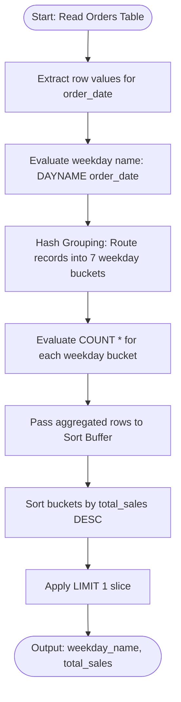
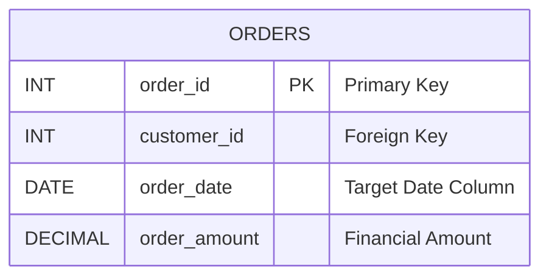

# Find weekdays with the highest sales

### 1. Structured Problem Statement

#### Objective
Identify the day of the week (e.g., Monday, Tuesday, etc.) that records the highest volume of sales transactions.

#### Business Scenario
Analyzing order volume patterns by day of the week is crucial for labor optimization, supply chain logistics, and targeted marketing campaigns. Retailers and e-commerce platforms use this metric to decide on which days to run promotional events, distribute newsletters, adjust dynamic shipping rates, or scale up warehouse staffing to meet anticipated shipping spikes.

#### Constraints & Challenges
* **SQL Dialect Divergence**: Extracting the day of the week from a date field is highly non-standardized. Different relational engines use incompatible functions (e.g., `DAYNAME()` in MySQL versus `TO_CHAR()` in PostgreSQL).
* **ANSI SQL Grouping Limitations**: Standard ANSI SQL restricts grouping by column aliases defined in the `SELECT` list. The query engine must group directly on the evaluated expression to ensure compatibility across strict execution planners.
* **Tie Handling**: If multiple days tie for the absolute maximum sales volume, a simple `LIMIT 1` will arbitrarily pick one weekday and omit the others. Utilizing a ranking window function is necessary when business requirements dictate identifying all tied peak-sale days.

### 2. The SQL Solution

This optimized, standard-compliant query extracts the weekday name, groups the sales metrics, and sorts the results to isolate the peak transaction day.

```sql
SELECT 
    -- Extract string representation of the weekday
    DAYNAME(order_date) AS weekday_name, 
    COUNT(*) AS total_sales
FROM Orders
-- Group by the raw functional expression to maintain strict ANSI standard compliance
GROUP BY DAYNAME(order_date)
-- Sort by the volume of transactions descending
ORDER BY total_sales DESC
-- Slice the top performing record
LIMIT 1;
```

> [!NOTE]  
> Grouping by the expression `DAYNAME(order_date)` rather than the alias `weekday_name` prevents compilation errors on legacy query planners or strict SQL engines (such as Oracle Database or standard Microsoft SQL Server), which evaluate the `GROUP BY` clause before parsing the `SELECT` list.

> [!TIP]  
> If business logic requires returning all tied days when multiple weekdays share the peak volume, use a CTE with a dense rank window function:
> ```sql
> WITH DailySalesRank AS (
>     SELECT 
>         DAYNAME(order_date) AS weekday_name,
>         COUNT(*) AS total_sales,
>         DENSE_RANK() OVER (ORDER BY COUNT(*) DESC) AS rnk
>     FROM Orders
>     GROUP BY DAYNAME(order_date)
> )
> SELECT weekday_name, total_sales
> FROM DailySalesRank
> WHERE rnk = 1;
> ```

### 3. Procedural Decomposition

The database engine processes this aggregation query through five distinct logical steps:

#### Phase 1: Storage Layer Data Scan
The engine scans the target `Orders` table, reading the physical rows and passing the `order_date` attribute values into the query processor's memory buffer.

#### Phase 2: Expression Evaluation
For each row retrieved, the query execution engine processes the `DAYNAME()` function (or regional equivalent) to convert the calendar date value (e.g., `2026-06-02`) into a string representation of the weekday (e.g., `Tuesday`).

#### Phase 3: Hash Bucket Aggregation
The engine instantiates a hash-based grouping table in-memory. Because there are only 7 possible weekdays, this hash table contains at most 7 buckets. As each row's weekday string is evaluated, the corresponding bucket's row counter (`COUNT(*)`) is incremented.

#### Phase 4: Downstream Sorting
Once the table scan concludes, the 7 aggregated rows are loaded into a sorting buffer. The engine sorts these 7 records in descending order according to the accumulated `total_sales` metric.

#### Phase 5: Result Slicing
The `LIMIT 1` operator terminates the processing cursor immediately after the first row of the sorted buffer is read, returning the name of the peak weekday along with its sales count.

### 4. Order of Execution & Activity Flow (Mermaid Diagram)



### 5. Database Schema (Mermaid Diagram)

The following schema diagram represents the physical layout of the `Orders` table, noting the index placements necessary for optimizing transactional aggregates.



> [!WARNING]  
> Direct indexing of the `order_date` column will not speed up the sorting or grouping phase of this query because of the function wrapper `DAYNAME()`. The engine is forced to evaluate the function for every row in the table (a full table scan). To optimize performance on large tables, implement an **expression-based index** or a **generated column** containing the pre-calculated weekday name:
> ```sql
> -- Example for PostgreSQL
> CREATE INDEX idx_orders_weekday ON Orders (EXTRACT(ISODOW FROM order_date));
> ```

> [!IMPORTANT]  
> Dialect translations for extracting weekday names:
> * **PostgreSQL**: Use `TO_CHAR(order_date, 'FMDay')`. The `FM` prefix prevents blank-padding spaces on the resulting string.
> * **SQL Server (T-SQL)**: Use `DATENAME(dw, order_date)`.
> * **Oracle Database**: Use `TO_CHAR(order_date, 'Day')`.

### 6. Practice Setup Script (DDL & DML)

This script provides standard, copy-pasteable database setup statements, incorporating a standard transactional layout and realistic, unbalanced weekly transaction records to verify correct execution.

```sql
-- Clean up target table if it already exists
DROP TABLE IF EXISTS Orders;

-- Create target orders table with primary keys and constraints
CREATE TABLE Orders (
    order_id INT NOT NULL,
    customer_id INT NOT NULL,
    order_date DATE NOT NULL,
    order_amount DECIMAL(10, 2) NOT NULL CHECK (order_amount > 0),
    CONSTRAINT pk_orders PRIMARY KEY (order_id)
);

-- Generate index on the target date column to facilitate date-range filtering
CREATE INDEX idx_orders_date ON Orders (order_date);

-- Populate table with unevenly distributed transaction dates:
-- 2026-06-01 is Monday (1 order)
-- 2026-06-02 is Tuesday (2 orders)
-- 2026-06-03 is Wednesday (1 order)
-- 2026-06-05 is Friday (4 orders) <-- Peak Sales Day
-- 2026-06-06 is Saturday (1 order)
INSERT INTO Orders (order_id, customer_id, order_date, order_amount) VALUES
(1001, 501, '2026-06-01', 150.00), -- Monday
(1002, 502, '2026-06-02', 95.50),  -- Tuesday
(1003, 503, '2026-06-02', 300.00), -- Tuesday
(1004, 504, '2026-06-03', 45.00),  -- Wednesday
(1005, 501, '2026-06-05', 120.00), -- Friday
(1006, 505, '2026-06-05', 85.00),  -- Friday
(1007, 502, '2026-06-05', 250.00), -- Friday
(1008, 503, '2026-06-05', 19.99),  -- Friday
(1009, 504, '2026-06-06', 500.00); -- Saturday
```
