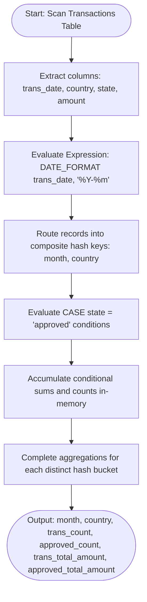
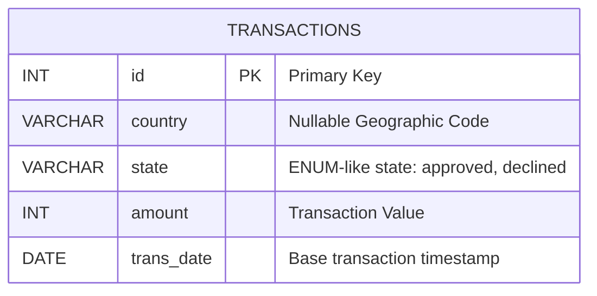

# Monthly Transactions
### 1. Structured Problem Statement

#### Objective
Generate a monthly financial report aggregating transactional statistics by calendar month and country. The report must provide the total transaction count, total transaction amount, count of approved transactions, and total approved amount.

#### Business Scenario
This query is a foundation of billing engines, payment gateway dashboards, and financial audit pipelines. In international commerce, platforms monitor regional transactional success metrics to evaluate regional payment processor performance, detect systemic decline issues, and report gross transaction volumes (GTV) by operating territory.

#### Constraints & Challenges
* **Single-Pass Conditional Aggregation**: To generate both general volume (all transactions) and specific state volumes (approved transactions) efficiently, the SQL engine should compute these metrics in a single table scan rather than splitting calculations into multiple joined subqueries.
* **Date Grouping Transformation**: Raw transaction timestamps contain discrete date values. To group them by year-month (e.g., `2019-01`), the engine must perform string-formatting or truncation operations on the date fields, preventing the direct use of standard range-based indexes unless optimized.
* **Nullable Grouping Attributes**: The `country` column may contain `NULL` values (representing transactions without IP resolution or geographic metadata). The aggregation must bundle these rows into a distinct, well-defined aggregate bucket rather than dropping them.

### 2. The SQL Solution

The query below uses conditional aggregation inside a standard `GROUP BY` framework, executing both the base and state-specific calculations in a single analytical pass.

```sql
SELECT 
    -- Transform discrete date into YYYY-MM format
    DATE_FORMAT(trans_date, '%Y-%m') AS month,
    country,
    -- Total transaction volume metrics
    COUNT(*) AS trans_count,
    -- Conditional aggregation for approved transaction volume
    SUM(CASE WHEN state = 'approved' THEN 1 ELSE 0 END) AS approved_count,
    -- Total transaction financial volume
    SUM(amount) AS trans_total_amount,
    -- Conditional aggregation for approved financial volume
    SUM(CASE WHEN state = 'approved' THEN amount ELSE 0 END) AS approved_total_amount
FROM Transactions
-- Group by transformed date expression and country
GROUP BY DATE_FORMAT(trans_date, '%Y-%m'), country;
```

> [!NOTE]  
> This query avoids using separate `LEFT JOIN` operations for approved and declined statuses. By nesting `CASE` statements directly within `SUM()` functions, the database engine maintains a single-row state memory during evaluation, keeping execution complexity at $O(N)$.

### 3. Procedural Decomposition

The query execution engine breaks this aggregation down into distinct operational phases:

#### Phase 1: Storage Scanning and Key Formulation
The storage engine reads rows from the `Transactions` table. For every row, the compute engine immediately evaluates the functional expression `DATE_FORMAT(trans_date, '%Y-%m')`, turning values like `2019-01-07` into the grouping key `2019-01`.

#### Phase 2: Hash Map Initialization
The execution planner allocates memory for an aggregation hash map where the composite bucket key is defined as `(month, country)`. As rows are processed:
* If the bucket key is not in the hash map, a new entry is initialized.
* If the bucket key is already present, the engine updates its active aggregate values.

#### Phase 3: In-Memory Conditional Accumulation
For each row routed to its matching bucket:
1. `trans_count` is incremented by `1`.
2. `trans_total_amount` is added to by `amount`.
3. The expression `state = 'approved'` is checked:
   * If true, `approved_count` is incremented by `1` and `approved_total_amount` is added to by `amount`.
   * If false, both aggregates receive `0` and remain unchanged.

#### Phase 4: Output Rendering
Once the entire transaction table is scanned, the compute engine flattens the hash map, projects the calculated metrics, and yields the final report.

### 4. Order of Execution & Activity Flow (Mermaid Diagram)



### 5. Database Schema (Mermaid Diagram)

The following schema diagram represents the `Transactions` table and identifies columns utilized in grouping and aggregation.



> [!TIP]  
> If querying massive historical tables, executing `DATE_FORMAT()` at runtime forces the database engine to perform a full table scan. To avoid this overhead, deploy a **generated virtual column** representing the formatted month, and index that virtual column alongside the `country` column:
> ```sql
> ALTER TABLE Transactions ADD COLUMN trans_month VARCHAR(7) 
> GENERATED ALWAYS AS (DATE_FORMAT(trans_date, '%Y-%m')) STORED;
> CREATE INDEX idx_monthly_geo ON Transactions(trans_month, country);
> ```

> [!WARNING]  
> If deploying this query in databases other than MySQL:
> * **PostgreSQL**: Replace `DATE_FORMAT()` with `TO_CHAR(trans_date, 'YYYY-MM')`.
> * **SQL Server (T-SQL)**: Use `CONVERT(VARCHAR(7), trans_date, 120)` as a highly performant alternative to the slower, CLR-dependent `FORMAT()` function.

### 6. Practice Setup Script (DDL & DML)

This script provides a clean PostgreSQL- and MySQL-compatible table creation schema, indexing patterns, and sample dataset including null attributes and mixed transaction states.

```sql
-- Clean up target table if it exists
DROP TABLE IF EXISTS Transactions;

-- Create target transaction table with structural constraints
CREATE TABLE Transactions (
    id INT NOT NULL,
    country VARCHAR(10),
    state VARCHAR(20) NOT NULL CHECK (state IN ('approved', 'declined')),
    amount INT NOT NULL,
    trans_date DATE NOT NULL,
    CONSTRAINT pk_transactions PRIMARY KEY (id)
);

-- Generate multi-column index covering routing fields
CREATE INDEX idx_transactions_routing ON Transactions (trans_date, country, state);

-- Populate with realistic mock transaction data
INSERT INTO Transactions (id, country, state, amount, trans_date) VALUES
(121, 'US', 'approved', 1000, '2018-12-18'),
(122, 'US', 'declined', 2000, '2018-12-19'),
(123, 'US', 'approved', 2000, '2019-01-01'),
(124, 'DE', 'approved', 2000, '2019-01-07'),
(125, 'DE', 'declined', 500,  '2019-01-15'),
(126, NULL, 'approved', 1500, '2019-01-15'), -- Captures missing geocodes
(127, NULL, 'declined', 300,  '2019-01-18');
```
