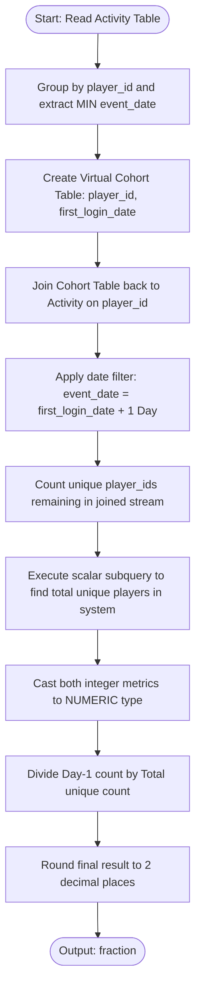
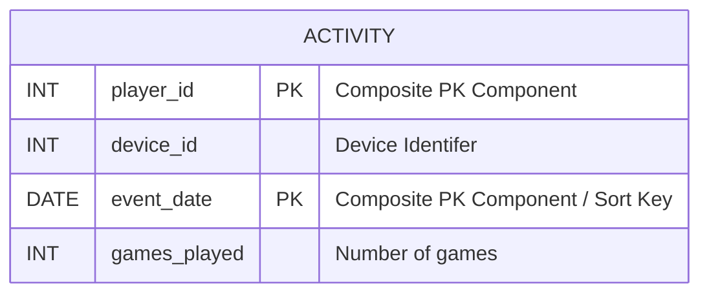

# Consecutive Logins

### 1. Structured Problem Statement

#### Objective
Calculate the day-1 retention rate of players, defined as the fraction of players who logged back into the system exactly one calendar day after their absolute first login date, rounded to two decimal places.

#### Business Scenario
Day-1 (D1) User Retention is a core product health metric across gaming, mobile applications, and subscription platforms. It measures the effectiveness of user onboarding, immediate product engagement, and initial user experience. Low D1 retention typically signals friction in the registration flow, performance issues, or a lack of immediate perceived value.

#### Constraints & Challenges
* **Anchor Identification**: The retention calculation must anchor strictly to each user's *first* login date (cohort creation date). Logins on consecutive days later in the user lifecycle (e.g., logging in on Day 10 and Day 11) must be ignored if they did not log in on Day 2 of their lifecycle.
* **Date Math Portability**: Date arithmetic syntax (such as checking if two dates are separated by exactly one day) varies significantly across database management systems, requiring design choices to ensure portability or clear platform-specific translation.
* **Integer Division Truncation**: Standard integer division in SQL engines like PostgreSQL and SQL Server truncates decimals (e.g., `2 / 3` evaluates to `0` rather than `0.67`). Explicit type-casting to a float or numeric type is required prior to the division step.

### 2. The SQL Solution

The optimized solution below isolates the cohort anchor dates within a Common Table Expression (CTE) and executes an index-friendly inner join back to the activity table to evaluate consecutive-day logins.

```sql
WITH FirstLoginCohort AS (
    -- Group by player to isolate the first login date (anchor date)
    SELECT 
        player_id, 
        MIN(event_date) AS first_login_date
    FROM Activity
    GROUP BY player_id
)
SELECT 
    ROUND(
        -- Cast the counts to Numeric to prevent integer division truncation
        CAST(COUNT(DISTINCT fl.player_id) AS NUMERIC) / 
        CAST((SELECT COUNT(DISTINCT player_id) FROM Activity) AS NUMERIC), 
        2
    ) AS fraction
FROM FirstLoginCohort fl
INNER JOIN Activity act 
   ON fl.player_id = act.player_id 
  -- Matches only if the player logged in exactly one day after first_login_date
  AND act.event_date = fl.first_login_date + INTERVAL '1' DAY;
```

> [!IMPORTANT]  
> Performing an `INNER JOIN` on `event_date = first_login_date + INTERVAL '1' DAY` filters the stream immediately. This is far more performant than performing a `LEFT JOIN` and checking conditions downstream with a `CASE` statement, as it allows the database planner to use a nested loop index join or a hash join directly.

> [!NOTE]  
> Date addition syntax differs by engine:
> * **PostgreSQL**: `fl.first_login_date + INTERVAL '1 day'` (or simply `fl.first_login_date + 1`).
> * **MySQL**: `DATE_ADD(fl.first_login_date, INTERVAL 1 DAY)` or `fl.first_login_date + INTERVAL 1 DAY`.
> * **SQL Server (T-SQL)**: `DATEADD(day, 1, fl.first_login_date)`.

### 3. Procedural Decomposition

The query processor executes this query using the following chronological phases:

#### Phase 1: Cohort Base Isolation (CTE Execution)
The database engine performs an aggregation over the `Activity` table. It groups the table by `player_id` and evaluates the scalar minimum of the `event_date` column (`MIN(event_date)`). This produces a virtual dataset containing one unique row per player paired with their initial signup date.

#### Phase 2: Probe Sequence (Inner Join)
The engine joins the virtual CTE back to the base `Activity` table. It matches rows on matching `player_id` values, while simultaneously checking a date-offset join condition: the record from `Activity` must match the date of the `first_login_date` shifted forward by exactly one day. Any player who did not log in on Day 2 is filtered out of the active stream at this stage.

#### Phase 3: Cohort Size Extraction (Scalar Subquery)
Separately, the database engine executes a quick scalar scan over the `Activity` table to determine the absolute count of unique players in the system: `SELECT COUNT(DISTINCT player_id) FROM Activity`. This serves as the constant denominator for the division.

#### Phase 4: Type Conversion and Mathematical Calculation
The engine takes the count of unique players remaining in the joined stream (the numerator) and casts both the numerator and the pre-calculated denominator to the `NUMERIC` data type. It divides the two values to yield a raw float value representing the retention fraction.

#### Phase 5: Final Formatting
The query engine applies the `ROUND` function to the division output, reducing the precision to two decimal places, and returns the single scalar value as `fraction`.

### 4. Order of Execution & Activity Flow (Mermaid Diagram)



### 5. Database Schema (Mermaid Diagram)

The following schema diagram represents the `Activity` table layout, illustrating the composite primary key configuration and the layout of the index required to optimize partition and sorting steps.



> [!TIP]  
> Because the primary key is defined composite as `(player_id, event_date)`, databases like MySQL (InnoDB) and PostgreSQL automatically structure the physical table or create index structures around this order. The `GROUP BY player_id` within the CTE can be satisfied by a fast index scan because the database can retrieve the minimum date for each unique player directly from the first index page of each player's leaf nodes.

### 6. Practice Setup Script (DDL & DML)

The following script contains standard DDL and realistic mock records to verify the consecutive login solution. It includes multi-login profiles, single-login profiles, and gap logins.

```sql
-- Clean up existing target table
DROP TABLE IF EXISTS Activity;

-- Create target transaction table with composite primary key
CREATE TABLE Activity (
    player_id INT NOT NULL,
    device_id INT NOT NULL,
    event_date DATE NOT NULL,
    games_played INT NOT NULL CHECK (games_played >= 0),
    CONSTRAINT pk_activity PRIMARY KEY (player_id, event_date)
);

-- Index specifically tailored to speed up search matching on dates and IDs
CREATE INDEX idx_activity_search_optimization
ON Activity (player_id, event_date);

-- Insert realistic mock data to evaluate retention conditions:
-- Player 1: First login '2016-03-01', logged in '2016-03-02' -> Retained (Day 1 check passed)
-- Player 2: First login '2017-06-25', logged in '2017-06-27' -> Not Retained (gap of 2 days)
-- Player 3: First login '2016-03-02', logged in '2016-03-03' -> Retained (Day 1 check passed)
-- Player 4: First login '2018-01-01', only logged in once      -> Not Retained (no subsequent logins)
-- Total Players = 4, Retained Players = 2. Expected output: 2 / 4 = 0.50
INSERT INTO Activity (player_id, device_id, event_date, games_played) VALUES
(1, 2, '2016-03-01', 5),
(1, 2, '2016-03-02', 6),
(2, 3, '2017-06-25', 1),
(2, 1, '2017-06-27', 0),
(3, 1, '2016-03-02', 0),
(3, 4, '2016-03-03', 8),
(3, 1, '2016-03-04', 5),
(4, 3, '2018-01-01', 2);
```
