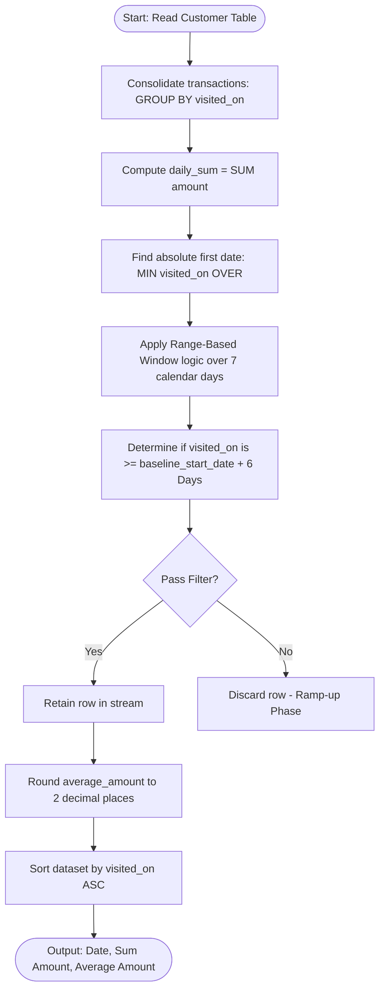
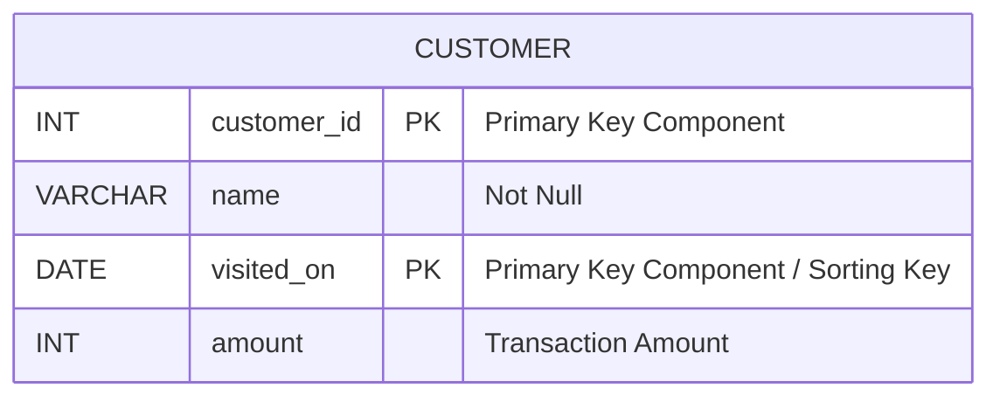

# Restaurant Growth 

### 1. Structured Problem Statement

#### Objective
Compute a 7-day moving sum and a 7-day moving average of daily customer transaction amounts, ensuring that only dates with a complete 7-day historical window are displayed.

#### Business Scenario
Analyzing rolling financial and operational metrics is standard practice in hospitality and retail analytics to eliminate short-term volatility (such as weekday-versus-weekend variance) and expose systemic growth patterns. This moving metric helps restaurant owners forecast staff requirements, plan inventory, and evaluate marketing campaign performance.

#### Constraints & Challenges
* **Multi-transaction Consolidation**: Multiple customer orders can occur on a single calendar day. Calculating rolling aggregates directly on raw rows leads to duplicate dates and incorrect time bounds. The transaction volume must be pre-aggregated to a single value per day before running totals are applied.
* **Logical vs. Physical Offsets**: Date sequences in production transactional systems can contain chronological gaps (e.g., if the restaurant closes on holidays). Standard row-based windows (`ROWS 6 PRECEDING`) assume a completely continuous series without gaps. If a day is missing, a physical offset will pull data from 7 operating days ago instead of 7 calendar days ago, introducing structural calculation errors.
* **The Ramp-Up Phase**: The earliest dates in the dataset do not possess 6 prior days of history. Calculating a moving average on these starting records would yield skewed metrics based on partial periods (e.g., a 2-day or 3-day average). These rows must be dynamically identified and excluded.

### 2. The SQL Solution

This solution uses a Common Table Expression (CTE) to sum the transaction amounts for each unique day, and then applies a logical date-range window function.

```sql
WITH DailyRevenue AS (
    -- Step 1: Consolidate multiple payments on the same calendar day
    SELECT 
        visited_on,
        SUM(amount) AS daily_sum
    FROM Customer
    GROUP BY visited_on
),
RollingMetrics AS (
    -- Step 2: Compute rolling sum and rolling average using logical date ranges
    SELECT 
        visited_on,
        SUM(daily_sum) OVER (
            ORDER BY visited_on 
            RANGE BETWEEN INTERVAL '6' DAY PRECEDING AND CURRENT ROW
        ) AS amount,
        ROUND(
            CAST(AVG(daily_sum) OVER (
                ORDER BY visited_on 
                RANGE BETWEEN INTERVAL '6' DAY PRECEDING AND CURRENT ROW
            ) AS NUMERIC), 2
        ) AS average_amount,
        -- Find the absolute first operating date in the dataset to filter the ramp-up phase
        MIN(visited_on) OVER () AS baseline_start_date
    FROM DailyRevenue
)
-- Step 3: Filter out rows where a full 7-day baseline does not exist
SELECT 
    visited_on,
    amount,
    average_amount
FROM RollingMetrics
WHERE visited_on >= baseline_start_date + INTERVAL '6' DAY
ORDER BY visited_on ASC;
```

> [!IMPORTANT]  
> The `RANGE` boundary construct represents logical offsets based on value differences, whereas `ROWS` represents physical row offsets. Using `RANGE BETWEEN INTERVAL '6' DAY PRECEDING AND CURRENT ROW` ensures that the database engine evaluates dates strictly on calendar-day math, even if calendar gaps exist within the underlying table storage.

> [!NOTE]  
> Syntax for date arithmetic varies by database platform:
> * **PostgreSQL**: Standard syntax is `RANGE BETWEEN INTERVAL '6 days' PRECEDING AND CURRENT ROW`.
> * **MySQL**: Standard syntax is `RANGE BETWEEN INTERVAL 6 DAY PRECEDING AND CURRENT ROW` and `baseline_start_date + INTERVAL 6 DAY`.
> * **SQL Server (T-SQL)**: Standard T-SQL `RANGE` window frames do not natively accept arbitrary intervals. In SQL Server, you must use a correlated subquery, an outer self-join on calendar tables, or compute dense sequence offsets using `DATEDIFF` to achieve equivalent logic.

### 3. Procedural Decomposition

The query processor executes this query through five sequential, logical stages:

#### Phase 1: Grouping and Daily Aggregation
The database engine executes the inner CTE `DailyRevenue`, grouping raw records in the `Customer` table by `visited_on`. It evaluates the total aggregate revenue (`SUM(amount)`) for each date, transforming a multi-row transaction log into a clean timeline of one row per operational day.

#### Phase 2: Computing the Chronological Baseline
Inside the `RollingMetrics` step, the database engine processes the window definition. It runs a global `MIN(visited_on) OVER ()` partition-less window aggregation to determine the oldest date present in the aggregated timeline, broadcasting this scalar date value into every row of the intermediate dataset.

#### Phase 3: Logical Range-Based Window Execution
As the engine iterates through the timeline, it uses the `visited_on` column as the index key for logical frame calculation:
* It looks at the current row's `visited_on` value.
* It calculates the lower-bound date limit: `visited_on - 6 days`.
* It identifies all rows in the dataset where the `visited_on` falls between that lower-bound date and the current row's date.
* It sums and averages these daily revenues to compute `amount` and `average_amount`.

#### Phase 4: Cold-Start / Ramp-up Filtering
The query engine evaluates the outer `WHERE` clause. It performs date-addition logic on the stored `baseline_start_date` by adding `6 days` to establish the boundary. Any records representing dates prior to this limit are pruned from the intermediate stream.

#### Phase 5: Projection and Final Sort
The engine projects the final columns (`visited_on`, `amount`, `average_amount`), casts the numeric fields to round them to two decimal places, and executes an ascending sort (`ORDER BY visited_on ASC`) on the remaining records before outputting the results.

### 4. Order of Execution & Activity Flow (Mermaid Diagram)


### 5. Database Schema (Mermaid Diagram)

The following schema diagram represents the transactional `Customer` table, indicating primary keys, indexes, and structural data types.



> [!TIP]  
> Because the query groups transactions by `visited_on` and computes window metrics ordered by this same attribute, a composite index configured as `(visited_on, amount)` is highly effective. This allows the query parser to perform a scan of the index to handle both the `GROUP BY` and the window function ordering without requiring a separate, memory-intensive sorting step.

### 6. Practice Setup Script (DDL & DML)

The following script sets up a test table, defines indexes, and populates it with realistic, multi-transaction, and out-of-order date entries.

```sql
-- Clean up existing target table
DROP TABLE IF EXISTS Customer;

-- Create target transaction table
CREATE TABLE Customer (
    customer_id INT NOT NULL,
    name VARCHAR(100) NOT NULL,
    visited_on DATE NOT NULL,
    amount INT NOT NULL CHECK (amount >= 0),
    CONSTRAINT pk_customer PRIMARY KEY (customer_id, visited_on)
);

-- Index the date and amount values for optimal aggregation performance
CREATE INDEX idx_customer_visited_amount 
ON Customer (visited_on, amount);

-- Populate table with standard test data:
-- Note: '2019-01-10' contains two distinct transactions to test daily group consolidation.
INSERT INTO Customer (customer_id, name, visited_on, amount) VALUES
(1, 'Jhon', '2019-01-01', 100),
(2, 'Daniel', '2019-01-02', 110),
(3, 'Jade', '2019-01-03', 120),
(4, 'Khaled', '2019-01-04', 130),
(5, 'Winston', '2019-01-05', 110),
(6, 'Elvis', '2019-01-06', 140),
(7, 'Anna', '2019-01-07', 150),
(8, 'Maria', '2019-01-08', 80),
(9, 'Jaze', '2019-01-09', 110),
(1, 'Jhon', '2019-01-10', 130),
(3, 'Jade', '2019-01-10', 150);
```
