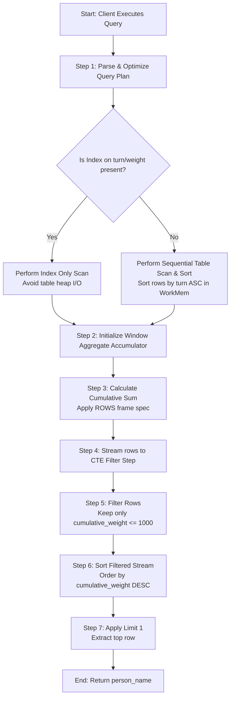
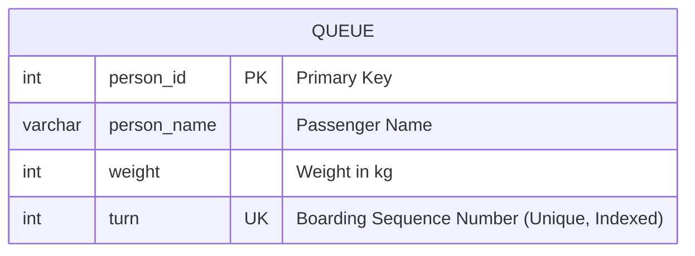

### 1. Structured Problem Statement

#### Objective
Identify the name of the last passenger (`person_name`) who can board a transit vehicle (such as a bus or elevator) without causing the cumulative weight of all boarded passengers to exceed a maximum threshold of $1000\text{ kg}$. 

#### Business Scenario & Constraints
* **Order of Boarding**: Passengers must board in a strict chronological or sequential order defined by the `turn` attribute (e.g., $1, 2, 3, \dots, N$).
* **Load Capacity**: The vehicle has a hard physical limit of $1000\text{ kg}$.
* **Deterministic Outcome**: The sequence is deterministic, meaning we cannot skip a heavy passenger to fit a lighter passenger downstream; boarding stops the moment the total weight of boarded passengers exceeds the threshold.
* **Scale & Volatility**: In high-velocity dispatching systems, this calculation must be run repeatedly on massive real-time queues, requiring an execution plan that scales efficiently.

#### Why Standard Relational Queries Struggle
Traditional SQL is designed around set theory, where rows are treated as unordered collections. Computing a cumulative running total historically required $O(N^2)$ self-joins (e.g., joining the table to itself where `A.turn >= B.turn`), which collapses under moderate datasets. While modern window functions (`SUM() OVER (...)`) optimize this to $O(N \log N)$, extracting the single point of inflection (the last acceptable row) requires specific structuring to avoid redundant table scans or unnecessary sort operations.

---

### 2. The SQL Solution

The query below uses a Common Table Expression (CTE) to calculate the running total of weights, followed by an outer filter and limit to extract the boundary passenger.

```sql
WITH CumulativeQueue AS (
    SELECT 
        person_name,
        weight,
        turn,
        -- Use ROWS instead of RANGE to bypass peer-value duplicate checks
        SUM(weight) OVER (
            ORDER BY turn 
            ROWS BETWEEN UNBOUNDED PRECEDING AND CURRENT ROW
        ) AS cumulative_weight
    FROM Queue
)
SELECT person_name
FROM CumulativeQueue
WHERE cumulative_weight <= 1000
ORDER BY cumulative_weight DESC
LIMIT 1;
```

> [!NOTE]
> Explicitly specifying `ROWS BETWEEN UNBOUNDED PRECEDING AND CURRENT ROW` is a critical performance detail. Without it, standard SQL defaults to `RANGE BETWEEN UNBOUNDED PRECEDING AND CURRENT ROW`, which forces the database engine to check for duplicate "peer" values in the `turn` column. Since `turn` is a unique key, utilizing `ROWS` directly signals the engine to skip peer-resolution checks, reducing CPU overhead [1].

---

### 3. Procedural Decomposition

The database engine processes this query through five distinct operational phases:

#### Phase 1: Data Acquisition & Index Scanning
The engine accesses the `Queue` table. If a composite index exists on `(turn, weight, person_name)`, the engine performs an **Index Only Scan** (or **Index-Covering Scan**). This allows the engine to retrieve all necessary fields directly from the B-Tree index without accessing the raw data pages (heap), completely eliminating disk I/O for the base table.

#### Phase 2: Sequential Projection & Window Aggregation
Using the pre-sorted order of the index (by `turn`), the engine streams the rows sequentially. As it processes each row, it maintains an in-memory accumulator to calculate the `cumulative_weight`. 
* Because the frame is defined as `ROWS BETWEEN UNBOUNDED PRECEDING AND CURRENT ROW`, the engine adds the current row's `weight` to the running sum and immediately writes the result to the pipeline without buffering subsequent rows for peer evaluation.

#### Phase 3: CTE Materialization / Pipeline Streaming
The calculated running totals are projected as a virtual dataset (`CumulativeQueue`). In most modern optimizers (e.g., PostgreSQL, MySQL 8.0+), the CTE is not materialized to physical disk or temp space; instead, it is streamed inline as a pipelined cursor directly to the parent operator.

#### Phase 4: Sifting and Filtering (The `WHERE` Clause)
The engine applies the predicate filter `WHERE cumulative_weight <= 1000`. 
* Rows that accumulate to $1000\text{ kg}$ or less are passed through.
* The first row that exceeds $1000\text{ kg}$ (and all subsequent rows, since `weight` is strictly positive) is discarded.

#### Phase 5: Descending Sort & Slicing
The qualified rows are ordered in descending order (`ORDER BY cumulative_weight DESC`).
* The engine uses a highly optimized **Top-N Sort** algorithm (specifically, keeping only the highest value).
* The `LIMIT 1` (or `FETCH FIRST 1 ROWS ONLY` in ANSI SQL) terminates the sorting early, extracting the very first row of the descending output, which represents the passenger who brought the bus closest to (but not exceeding) the $1000\text{ kg}$ limit.

---

### 4. Order of Execution & Activity Flow

The following flowchart maps the logical and physical execution steps performed by the database engine:



---

### 5. Database Schema

The diagram below outlines the physical schema design for the `Queue` table.



> [!IMPORTANT]
> To optimize this query for production environments, a composite index must be created on `(turn, weight)` and include `person_name` (or a covering index on all three columns). This structure satisfies both the sorting requirement of the window function (`turn`) and the payload selection (`weight`, `person_name`) without triggering physical table lookups.

---

### 6. Practice Setup Script (DDL & DML)

This script is fully compatible with standard PostgreSQL and MySQL installations. It creates the schema, builds the necessary covering indexes, and populates data covering standard configurations, exact limit thresholds, and edge cases.

```sql
-- ==========================================
-- 1. CLEANUP EXISTING OBJECTS
-- ==========================================
DROP TABLE IF EXISTS Queue;

-- ==========================================
-- 2. CREATE SCHEMA (DDL)
-- ==========================================
CREATE TABLE Queue (
    person_id INT PRIMARY KEY,
    person_name VARCHAR(100) NOT NULL,
    weight INT NOT NULL CHECK (weight > 0),
    turn INT UNIQUE NOT NULL CHECK (turn > 0)
);

-- ==========================================
-- 3. CREATE COVERING INDEX FOR WINDOW FUNCTION
-- ==========================================
-- For PostgreSQL:
CREATE INDEX idx_queue_turn_weight_incl ON Queue (turn, weight) INCLUDE (person_name);

-- For MySQL (uncomment if using MySQL instead of PostgreSQL):
-- CREATE INDEX idx_queue_turn_weight_name ON Queue (turn, weight, person_name);


-- ==========================================
-- 4. INSERT REALISTIC TEST DATA (DML)
-- ==========================================
-- Scenario: 
-- Turn 1: Alice (250kg) -> Running Total: 250kg
-- Turn 2: Alex (350kg)  -> Running Total: 600kg
-- Turn 3: John (400kg)  -> Running Total: 1000kg (EXACT LIMIT)
-- Turn 4: Winston (100kg)-> Running Total: 1100kg (EXCEEDS LIMIT)
-- Turn 5: Marie (120kg)  -> Running Total: 1220kg
INSERT INTO Queue (person_id, person_name, weight, turn) VALUES
(5, 'Alice', 250, 1),
(3, 'Alex', 350, 2),
(6, 'John', 400, 3),
(2, 'Winston', 100, 4),
(1, 'Marie', 120, 5);

-- ==========================================
-- 5. ALTERNATIVE TEST CASES (For Manual Validation)
-- ==========================================
-- To test a scenario where the first person exceeds the limit:
-- UPDATE Queue SET weight = 1001 WHERE turn = 1; -- (Expected: returns 0 rows/NULL)

-- To test non-sequential gaps in turns (e.g., turn 1, 3, 7):
-- UPDATE Queue SET turn = 10 WHERE turn = 3; -- Ensure sorting still behaves correctly
```

> [!WARNING]
> **Edge Case Handling**: If the first passenger in the sequence (`turn = 1`) has a `weight` that exceeds the $1000\text{ kg}$ limit, the query will return an empty result set (no rows). In a production environment, you should handle this `NULL` or empty state within your application logic or wrapper SQL functions (e.g., using a fallback default value) [1].
