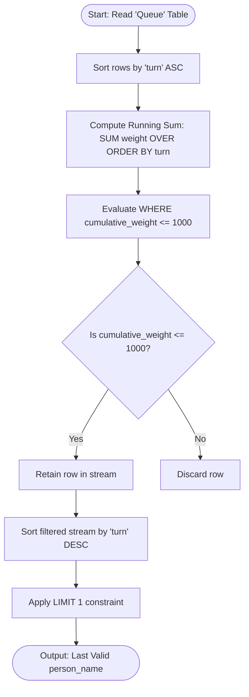
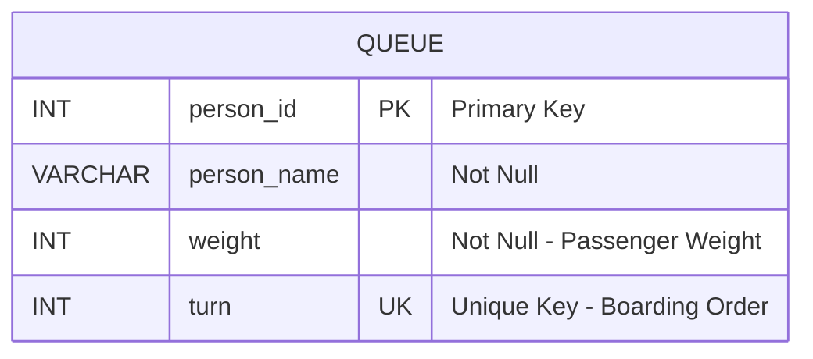

# Last Person to Fit in the Bus
### 1. Structured Problem Statement

#### Objective
Identify the name of the last passenger who can board a bus without causing the total cumulative weight of all boarded passengers to exceed a strict limit of 1000 kilograms.

#### Business Scenario
This scenario represents a classic "first-fit-sequential" constraint problem, common in logistics, shipping container loading, queue processing, and resource allocation systems. When physical or virtual limits (such as network bandwidth, transaction batch sizes, or vehicle carrying capacities) are rigid, items or passengers must be evaluated in a deterministic, chronological sequence until a threshold is crossed. 

#### Constraints & Challenges
* **Strict Sequential Processing**: Passengers must board in the precise sequence defined by their assigned `turn`. Random-access fitting (e.g., solving it as a knapsack problem to maximize the number of people) is not permitted.
* **Cumulative State Tracking**: Standard relational operations operate on set-based logic, which naturally struggles to track running aggregates (cumulative states) without relying on procedural code, expensive self-joins, or window functions.
* **Performance at Scale**: Utilizing self-joins (e.g., joining the table on itself where `A.turn >= B.turn`) scales quadratically ($O(N^2)$), causing execution times to degrade rapidly as the size of the queue increases.

### 2. The SQL Solution

The query below utilizes an optimized Common Table Expression (CTE) combined with a window aggregate function to calculate the running total in a single scan of the dataset.

```sql
WITH CumulativeWeightCTE AS (
    SELECT 
        person_name,
        turn,
        -- Calculate running total weight ordered by turn sequence
        SUM(weight) OVER (
            ORDER BY turn 
            ROWS BETWEEN UNBOUNDED PRECEDING AND CURRENT ROW
        ) AS cumulative_weight
    FROM Queue
)
SELECT person_name
FROM CumulativeWeightCTE
-- Filter for states that do not violate the 1000 kg capacity limit
WHERE cumulative_weight <= 1000
-- Order in descending sequence to identify the last eligible passenger
ORDER BY turn DESC
LIMIT 1;
```

> [!NOTE]  
> The use of `ROWS BETWEEN UNBOUNDED PRECEDING AND CURRENT ROW` explicitly instructs the database engine to use a physical frame rather than a logical frame (`RANGE`). Many relational databases default to `RANGE` when a window frame is omitted, which requires the engine to evaluate duplicate values and often writes intermediate spool files to disk, degrading query performance.

> [!TIP]  
> If executing this query in Microsoft SQL Server or Oracle Database, replace the MySQL/PostgreSQL `LIMIT 1` syntax with the ANSI-compliant `FETCH FIRST 1 ROW ONLY` or select top-level rows using `TOP 1`.

### 3. Procedural Decomposition

The database engine processes this query in four main logical phases:

#### Phase 1: Storage Engine Access and Sorting
The database engine accesses the storage engine to retrieve records from the `Queue` table. If a supporting index exists on the `turn` column, the engine reads the index in order. If no index exists, the engine performs a full table scan and stores the dataset in a temporary worktable or sort buffer to order the rows by `turn` in ascending sequence.

#### Phase 2: Window Aggregation execution
As the database engine iterates through the sorted records, it maintains a running sum of the `weight` column in memory. 
* For the first row (`turn = 1`), `cumulative_weight` is equal to the first passenger's weight.
* For each subsequent row, the engine adds the current row's `weight` to the accumulated sum of the preceding rows.
This execution avoids an expensive quadratic self-join, running in linear time ($O(N)$).

#### Phase 3: CTE Materialization and Filtering
The output of the window aggregation is presented as a virtual relation (`CumulativeWeightCTE`). The query engine evaluates the outer query's `WHERE` clause, processing each row and discarding any record where the `cumulative_weight` is strictly greater than 1000. 

#### Phase 4: Sorting and Limit Application
The remaining qualified records (all passengers whose boarding did not violate the limit) are sorted in descending order by `turn` (which is functionally equivalent to sorting by `cumulative_weight` because weights are strictly positive numbers). The engine then applies the `LIMIT 1` operator, retrieving the top record—which represents the last valid person to step onto the bus—and terminates execution.

### 4. Order of Execution & Activity Flow (Mermaid Diagram)



### 5. Database Schema (Mermaid Diagram)

The following entity-relationship diagram depicts the schema of the `Queue` table and highlights the necessary index strategy to eliminate explicit sort operations during runtime.



> [!IMPORTANT]  
> To optimize this query for production workloads, a unique index must be created on the `turn` column. Ideally, a covering index containing `(turn, weight, person_name)` should be constructed. This allows the query engine to perform an Index-Only Scan (or Index Covered Scan), pulling both the sorting sequence and the data payloads directly from the leaf nodes of the B-Tree index without hitting the underlying table heap.

### 6. Practice Setup Script (DDL & DML)

This script provides a clean PostgreSQL- and MySQL-compatible setup including table structure constraints, a covering index, and real-world test cases. The test cases include edge conditions, such as the exact boundary condition (the cumulative sum hitting precisely 1000 kg).

```sql
-- Clean up existing tables
DROP TABLE IF EXISTS Queue;

-- Create target table with appropriate constraints
CREATE TABLE Queue (
    person_id INT NOT NULL,
    person_name VARCHAR(100) NOT NULL,
    weight INT NOT NULL CHECK (weight > 0),
    turn INT NOT NULL UNIQUE,
    CONSTRAINT pk_queue PRIMARY KEY (person_id)
);

-- Create a covering index to optimize the window execution and sorting phases
CREATE INDEX idx_queue_covering 
ON Queue (turn, weight, person_name);

-- Populate table with realistic test scenario:
-- Cumulative calculation:
-- Turn 1: Alice (250 kg)      | Cumulative: 250 kg
-- Turn 2: Bob (350 kg)        | Cumulative: 600 kg
-- Turn 3: Charlie (400 kg)    | Cumulative: 1000 kg  <-- EXACT LIMIT REACHED
-- Turn 4: Diana (200 kg)      | Cumulative: 1200 kg  (Over Limit)
-- Turn 5: Ethan (100 kg)      | Cumulative: 1300 kg  (Over Limit)
-- Expected Output: 'Charlie'

INSERT INTO Queue (person_id, person_name, weight, turn) VALUES
(101, 'Alice', 250, 1),
(102, 'Bob', 350, 2),
(103, 'Charlie', 400, 3),
(104, 'Diana', 200, 4),
(105, 'Ethan', 100, 5);
```
