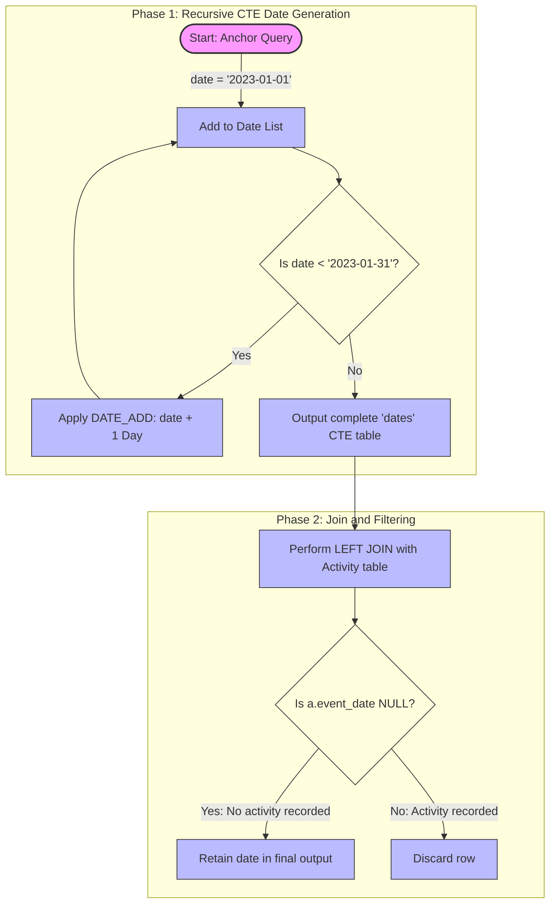

# 7. Find Missing Dates (Custom Problem)


## Problem Statement

In data analysis and reporting, we often need to identify periods of inactivity. However, relational database tables only store records for events that actually occurred (e.g., a transaction, a login, or a page view). If no activity happens on a given day, there is typically no row recorded for that date. 

To detect these inactive days within a specific time window, we must compare a complete, uninterrupted sequence of dates against our transaction or activity log. 

### Objective
Given an `Activity` table with an `event_date` column, identify all dates within a target range (e.g., January 1, 2023, to January 31, 2023) on which **no activity** was recorded.

## Solution

The following SQL query uses a Recursive Common Table Expression (CTE) to dynamically construct a calendar of dates and identifies missing entries via an anti-join pattern.

```sql
WITH RECURSIVE dates AS (
    -- Anchor member: Define the start date of the range
    SELECT CAST('2023-01-01' AS DATE) AS date
    
    UNION ALL
    
    -- Recursive member: Increment the date by 1 day
    SELECT DATE_ADD(date, INTERVAL 1 DAY)
    FROM dates
    WHERE date < '2023-01-31'
)
-- Main query: Identify dates with no matching activity
SELECT d.date
FROM dates d
LEFT JOIN Activity a ON d.date = a.event_date
WHERE a.event_date IS NULL;
```

> [!NOTE]  
> The explicit `CAST('2023-01-01' AS DATE)` in the anchor member is recommended in many SQL dialects to ensure the recursive step maintains the correct date data type, preventing type mismatch errors during execution.

## Procedural Decomposition

The execution of this query can be broken down into two primary phases: **Date Generation** (via the CTE) and **Missing Date Filtering** (via the main query).

### Phase 1: Date Generation (Recursive CTE)
1. **The Anchor Member**: The engine executes the first query block inside the CTE. It establishes the initial state with a single row containing the base date `'2023-01-01'`.
2. **The Recursive Step**: The engine repeatedly executes the second query block. In each iteration, it takes the output of the previous step and applies `DATE_ADD(date, INTERVAL 1 DAY)`.
3. **The Termination Condition**: The recursion continues as long as the evaluation of the `WHERE` clause (`date < '2023-01-31'`) returns true. Once the date reaches `'2023-01-31'`, the recursion stops, resulting in a temporary dataset of 31 consecutive dates.

> [!WARNING]  
> Recursive CTEs are subject to system limits. For instance, in MySQL, the default recursion depth is controlled by the `cte_max_recursion_depth` system variable (defaulting to 1000). If you are generating date sequences spanning several years, you may need to increase this limit or use a physical calendar table.

### Phase 2: Isolation of Missing Activity (Anti-Join)
1. **The Left Join**: The generated sequence of dates (`dates`) is left-joined with the `Activity` table on the date columns (`d.date = a.event_date`). This preserves all 31 generated dates, matching them with activity records where they exist.
2. **Filtering Non-Matches**: The `WHERE a.event_date IS NULL` clause filters out any rows where a match was found in the `Activity` table.
3. **Final Projection**: Only the dates that had no corresponding records in the `Activity` table are returned.

> [!TIP]  
> The `LEFT JOIN` combined with a `WHERE ... IS NULL` filter is a standard SQL performance pattern known as an **anti-join**. It is often optimized efficiently by modern database execution engines compared to alternative patterns like `NOT IN` (which can behave unexpectedly if nulls are present) or `NOT EXISTS`.

## Order of Execution & Activity Flow

The diagram below illustrates how the query compiles the dates recursively before validating them against the event log.



> [!IMPORTANT]  
> Ensure that an index exists on the `Activity(event_date)` column. Without proper indexing on the join key, the database must perform a full-table scan of the `Activity` table for every date generated by the CTE, which can degrade performance on larger datasets.
