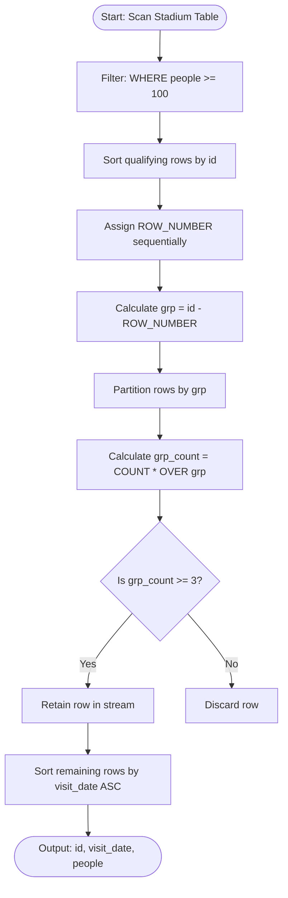
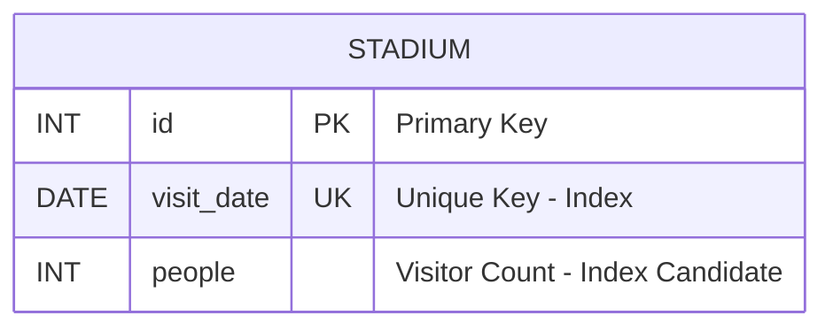

# Human Traffic of Stadium

### 1. Structured Problem Statement

#### Objective
Identify all daily records (containing ID, visit date, and visitor volume) where the visitor volume is 100 or more for at least three consecutive days.

#### Business Scenario
This pattern represents a standard "Gaps-and-Islands" analysis, commonly used in public safety planning, retail venue capacity tracking, and network bandwidth monitoring. Stadium operations, municipal transport authorities, and event planners track sustained high-traffic periods to adjust security protocols, dispatch auxiliary transport, manage staff shift scaling, and distinguish isolated daily spikes from prolonged crowd events.

#### Constraints & Challenges
* **Pre-Aggregation Filtering**: The consecutive-day pattern must be evaluated strictly *after* applying the filtering threshold of 100+ visitors.
* **Chronological Discontinuity**: Filtering out low-traffic days leaves gaps in the sequential database keys (`id`). A mathematical mechanism is required to group these remaining "islands" of consecutive dates together across the "oceans" of filtered-out days.
* **Gaps-and-Islands Mechanics**: Basic SQL grouping and aggregation collapse records into a single summary row per group. To retain the discrete, individual daily records that make up the qualifying consecutive periods, window functions are required to compute the group sizes without losing row-level granularity.

---

### 2. The SQL Solution

This optimized solution uses a Common Table Expression (CTE) to calculate group identifiers using mathematical rank differences, and then applies a window-based partition count to filter the groups efficiently.

```sql
WITH FilteredStadium AS (
    -- Step 1: Filter for high-traffic records and calculate a grouping gap identifier
    SELECT 
        id, 
        visit_date, 
        people,
        -- Subtracting the sequential row number from the sequential ID 
        -- keeps the difference constant for contiguous (consecutive) groups
        id - ROW_NUMBER() OVER (ORDER BY id) AS grp
    FROM Stadium
    WHERE people >= 100
),
GroupSizes AS (
    -- Step 2: Compute group size dynamically using partition aggregates
    SELECT 
        id, 
        visit_date, 
        people,
        grp,
        COUNT(*) OVER (PARTITION BY grp) AS grp_count
    FROM FilteredStadium
)
-- Step 3: Extract individual records from groups meeting the 3-day threshold
SELECT 
    id, 
    visit_date, 
    people
FROM GroupSizes
WHERE grp_count >= 3
ORDER BY visit_date ASC;
```

> [!IMPORTANT]  
> **Avoiding Double scans**:
> Using a second window function `COUNT(*) OVER (PARTITION BY grp)` inside a secondary CTE is highly efficient. This allows the query engine to calculate the size of each island and append it to individual rows in a single step, bypassing the need to join back to a grouped subquery.

> [!NOTE]  
> This Gaps-and-Islands technique assumes that the column `id` increases sequentially by 1 along with `visit_date` without gaps in the original table. If the raw table has gaps in its natural `id` sequence, generate a surrogate sequential key first using `ROW_NUMBER() OVER (ORDER BY visit_date)` before applying the island-grouping subtraction.

---

### 3. Procedural Decomposition

The database engine processes this query through five sequential execution phases:

#### Phase 1: Predicate Filtering
The database scans the `Stadium` table and filters out all rows where `people < 100`. Only rows meeting the high-traffic threshold are passed to the next phase.

#### Phase 2: Generating the Group Gap Identifier (`grp`)
For the surviving records (sorted by `id`), the query engine assigns a sequential, monotonic rank using `ROW_NUMBER()`. It then subtracts this rank from the record's natural `id`:
* **Consecutive Rows**: Because both the `id` and the `ROW_NUMBER` increment by 1 for consecutive records, their difference (`id - ROW_NUMBER`) remains constant, grouping them into an "island".
* **Gaps**: When a gap occurs because low-traffic rows were filtered out, the natural `id` jumps while the `ROW_NUMBER` only increments by 1. The difference shifts to a new constant value, marking the start of a new "island".

#### Phase 3: Window-Based Group Size Computation
In the `GroupSizes` CTE, the engine partitions the rows by the generated `grp` key. It counts the number of records within each partition and appends this count to each row as `grp_count`, keeping the individual daily records intact.

#### Phase 4: Threshold Filtering
The outer query evaluates the `WHERE grp_count >= 3` filter. Any rows belonging to groups with fewer than three consecutive records are discarded.

#### Phase 5: Final Sorting and Projection
The surviving rows are sorted by `visit_date` in ascending order and returned.

---

### 4. Order of Execution & Activity Flow (Mermaid Diagram)



---

### 5. Database Schema (Mermaid Diagram)

The following schema diagram represents the `Stadium` table layout and outlines the indexing strategy required to optimize sequential pattern analysis.



> [!TIP]  
> To optimize this query on large datasets, implement a composite index on `(people, id, visit_date)`. This index allows the engine to quickly filter out rows with fewer than 100 visitors and read the qualifying IDs and dates directly from the index nodes, avoiding disk reads on the table data:
> ```sql
> CREATE INDEX idx_stadium_people_id ON Stadium (people, id, visit_date);
> ```

---

### 6. Practice Setup Script (DDL & DML)

The following script builds the testing schema, establishes unique date constraints, and populates the table with test cases—including single-day spikes, 2-day clusters, and 3+-day consecutive runs—to verify query accuracy.

```sql
-- Clean up target table if it already exists
DROP TABLE IF EXISTS Stadium;

-- Create target human traffic table
CREATE TABLE Stadium (
    id INT NOT NULL,
    visit_date DATE NOT NULL,
    people INT NOT NULL,
    CONSTRAINT pk_stadium PRIMARY KEY (id),
    CONSTRAINT uk_stadium_date UNIQUE (visit_date)
);

-- Index targeted at speeding up predicate evaluations
CREATE INDEX idx_stadium_traffic ON Stadium (people, id, visit_date);

-- Populate table with test scenarios:
-- ID 1-3: Consecutive days with 100+ visitors (3-day streak) -> Expected: MATCH
-- ID 4: Single low-traffic day -> Expected: EXCLUDED (breaks streak)
-- ID 5-6: Consecutive days with 100+ visitors (only 2 days) -> Expected: EXCLUDED (falls short)
-- ID 7: Single low-traffic day -> Expected: EXCLUDED
-- ID 8-11: Consecutive days with 100+ visitors (4-day streak) -> Expected: MATCH
INSERT INTO Stadium (id, visit_date, people) VALUES
(1, '2026-06-01', 105), -- Streak A
(2, '2026-06-02', 150), -- Streak A
(3, '2026-06-03', 99),  -- Streak A ends (falls below 100)
(4, '2026-06-04', 120), -- Streak B (Starts - ID 4)
(5, '2026-06-05', 145), -- Streak B (ID 5)
(6, '2026-06-06', 150), -- Streak B (ID 6 - 3 Consecutive Days)
(7, '2026-06-07', 30),  -- Gap (breaks streak)
(8, '2026-06-08', 199), -- Streak C (Starts - ID 8)
(9, '2026-06-09', 188), -- Streak C (ID 9)
(10, '2026-06-10', 88), -- Streak C ends (falls below 100)
(11, '2026-06-11', 115), -- Streak D (Starts - ID 11)
(12, '2026-06-12', 120), -- Streak D (ID 12)
(13, '2026-06-13', 101), -- Streak D (ID 13 - 3 Consecutive Days)
(14, '2026-06-14', 125); -- Streak D (ID 14 - 4 Consecutive Days)
```
