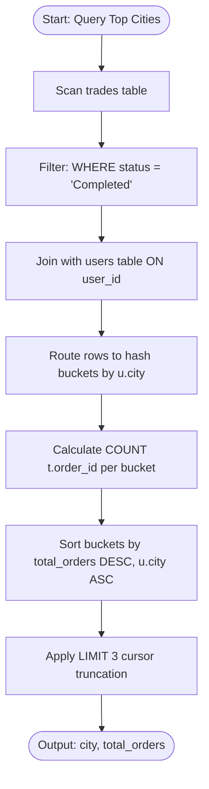
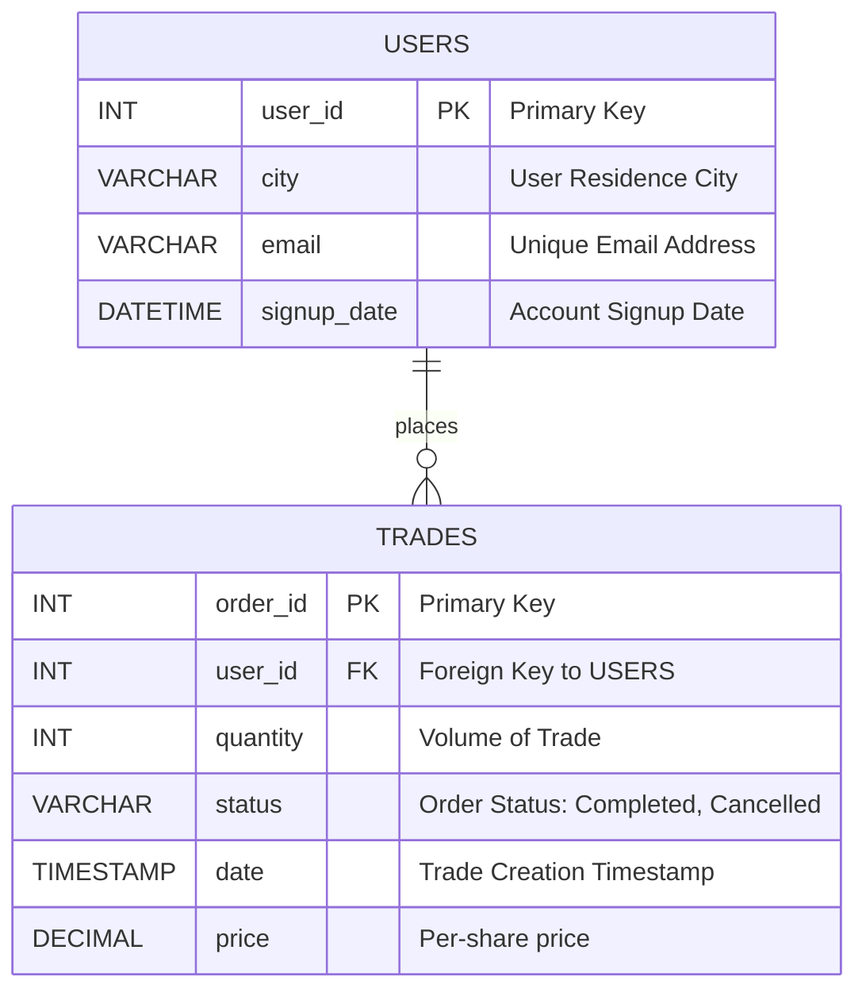

### 1. Structured Problem Statement

#### Objective
Analyze trading transaction logs and user accounts to identify the top three cities that have registered the highest number of completed trade orders, sorted in descending order of trade counts.

#### Business Scenario
Regional market penetration and transaction density analysis are fundamental to retail brokerage and fintech platform operations. Payment processors and trading systems analyze geographic transaction patterns to optimize regional database read-replica distribution, direct geo-targeted marketing campaigns, evaluate regional acquisition costs, and balance liquidity reserves based on localized activity trends.

#### Constraints & Challenges
* **Relational Normalization**: Transaction logs (`trades`) do not directly store geographic customer metadata (such as city). This requires joining transaction tables with user directories (`users`) before executing grouping calculations.
* **Non-Completed Order Exclusions**: Orders contain various states (such as `Cancelled` or `Pending`). Uncompleted transactions must be filtered out at the index or data scan level to prevent counting invalid financial volumes.
* **Deterministic Tie-Breaking**: When sorting aggregate outputs to extract a sliced subset (like `LIMIT 3`), records with identical transaction volumes must have a deterministic tie-breaker (such as alphabetical order of cities) to prevent unstable results across separate execution runs.

### 2. The SQL Solution

This query joins the transaction and user profiles, filters for completed orders, aggregates volume by city, and implements a deterministic sorting limit.

```sql
SELECT 
    u.city,
    COUNT(t.order_id) AS total_orders
FROM trades t
INNER JOIN users u
    ON t.user_id = u.user_id
-- Filter out non-completed transactions before grouping
WHERE t.status = 'Completed'
GROUP BY u.city
-- Secondary sort key ensures deterministic results on matching totals
ORDER BY total_orders DESC, u.city ASC
LIMIT 3;
```

> [!IMPORTANT]  
> **The Determinism Requirement**:
> Using `LIMIT` without a secondary unique sorting column (like `u.city ASC`) can cause the database engine to return different records on subsequent runs. This happens when multiple cities share the same order count, as the physical storage order of rows on disk can dictate which record gets sliced first.

> [!TIP]  
> **Handling Tied Rankings with Window Functions**:
> If the business requirement changes to include all cities tied for the top three slots, replace the `LIMIT 3` clause with a `DENSE_RANK()` window partition:
> ```sql
> WITH RankedCities AS (
>     SELECT 
>         u.city,
>         COUNT(t.order_id) AS total_orders,
>         DENSE_RANK() OVER (ORDER BY COUNT(t.order_id) DESC) AS city_rank
>     FROM trades t
>     INNER JOIN users u ON t.user_id = u.user_id
>     WHERE t.status = 'Completed'
>     GROUP BY u.city
> )
> SELECT city, total_orders
> FROM RankedCities
> WHERE city_rank <= 3
> ORDER BY total_orders DESC, city ASC;
> ```

### 3. Procedural Decomposition

The query planner coordinates the evaluation of this multi-table aggregation through five distinct phases:

#### Phase 1: Storage Predicate Filtering
The engine scans the `trades` table, filtering out all records where `status != 'Completed'`. Only successful transaction rows are passed to the join step.

#### Phase 2: Relational Join Execution
The filtered trade record stream is joined with the `users` table on the `user_id` attribute. Typically, a hash join or index nested loop is executed: the engine utilizes the primary key index on `users.user_id` to quickly locate and append the `city` column to each transaction record.

#### Phase 3: Hash Map Aggregation
The combined record stream is routed into an aggregation hash map in memory. The engine uses `u.city` as the hash bucket key. As rows are processed, the engine increments the `total_orders` counter (`COUNT(t.order_id)`) inside the matching city's bucket.

#### Phase 4: Sorting Evaluation
Once all records are grouped, the distinct city buckets are loaded into a sorting buffer. The records are sorted primarily in descending order of `total_orders`, with a secondary ascending alphabetical sort on the `city` name.

#### Phase 5: Cursor Truncation and Output
The `LIMIT 3` filter is applied to the sorted list. The query engine extracts the top three records from the sorted stream, projects the `city` and `total_orders` columns, and returns them to the client.

### 4. Order of Execution & Activity Flow (Mermaid Diagram)



### 5. Database Schema (Mermaid Diagram)

The following schema diagram represents the database tables and key constraints. It highlights the primary key to foreign key association and suggests index configurations for high-frequency queries.



> [!IMPORTANT]  
> To optimize this join pipeline on high-volume production tables, create a composite index on `trades (status, user_id)` and ensure `users (user_id)` is indexed. This index design allows the query optimizer to filter the status and extract the user mapping without needing a full table scan on `trades`.

### 6. Practice Setup Script (DDL & DML)

This script builds the database schema with constraints, implements index placements, and populates the tables with transaction and user profile data to verify the solution.

```sql
-- Clean up existing tables
DROP TABLE IF EXISTS trades;
DROP TABLE IF EXISTS users;

-- Create users table
CREATE TABLE users (
    user_id INT NOT NULL,
    city VARCHAR(100) NOT NULL,
    email VARCHAR(255) NOT NULL UNIQUE,
    signup_date DATETIME NOT NULL,
    CONSTRAINT pk_users PRIMARY KEY (user_id)
);

-- Create trades table
CREATE TABLE trades (
    order_id INT NOT NULL,
    user_id INT NOT NULL,
    quantity INT NOT NULL CHECK (quantity > 0),
    status VARCHAR(20) NOT NULL CHECK (status IN ('Completed', 'Cancelled')),
    date TIMESTAMP NOT NULL,
    price DECIMAL(5, 2) NOT NULL CHECK (price > 0),
    CONSTRAINT pk_trades PRIMARY KEY (order_id),
    CONSTRAINT fk_trades_users FOREIGN KEY (user_id) REFERENCES users (user_id)
);

-- Indexing optimized for status filtering and joining operations
CREATE INDEX idx_trades_status_user ON trades (status, user_id);

-- Populate users dataset
INSERT INTO users (user_id, city, email, signup_date) VALUES
(111, 'San Francisco', 'rrok10@gmail.com', '2021-08-03 12:00:00'),
(148, 'Boston', 'sailor9820@gmail.com', '2021-08-20 12:00:00'),
(178, 'San Francisco', 'harrypotterfan182@gmail.com', '2022-01-05 12:00:00'),
(265, 'Denver', 'shadower_@hotmail.com', '2022-02-26 12:00:00'),
(300, 'San Francisco', 'houstoncowboy1122@hotmail.com', '2022-06-30 12:00:00');

-- Populate trades dataset
INSERT INTO trades (order_id, user_id, quantity, status, date, price) VALUES
(100101, 111, 10, 'Cancelled', '2022-08-17 12:00:00', 9.80), -- Excluded (Cancelled)
(100102, 111, 10, 'Completed', '2022-08-17 12:00:00', 10.00), -- Match SF (1)
(100259, 148, 35, 'Completed', '2022-08-25 12:00:00', 5.10),  -- Match Boston (1)
(100264, 148, 40, 'Completed', '2022-08-26 12:00:00', 4.80),  -- Match Boston (2)
(100305, 300, 15, 'Completed', '2022-09-05 12:00:00', 10.00), -- Match SF (2)
(100400, 178, 32, 'Completed', '2022-09-17 12:00:00', 12.00), -- Match SF (3)
(100565, 265, 2,  'Completed', '2022-09-27 12:00:00', 8.70);  -- Match Denver (1)
```
